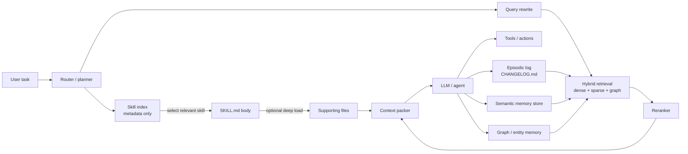
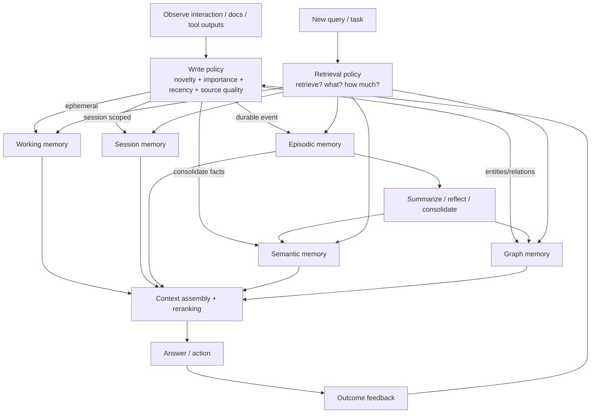

# LLM Agentic Memory Maps for Private Knowledge and Long-Horizon Work

## Executive summary

The strongest conclusion from the literature is that **long context is not a substitute for memory architecture**. As context grows, models still show position sensitivity, degraded retrieval from the middle of prompts, weaker reasoning under heavy context load, and non-uniform quality across long inputs. The clearest evidence comes from **Lost in the Middle**, **LongBench**, **RULER**, **NoLiMa**, and the **Context Rot** technical report, which together show that simply “stuffing more text into context” often produces worse or less reliable behavior than targeted retrieval or explicit memory management. citeturn38search0turn6search4turn6search5turn6search6turn7search2

The field has therefore converged on **layered memory systems**: a small working context; an external store for episodic traces, summaries, or files; a semantic retrieval layer over documents, entities, or graphs; and a policy for deciding what to write, consolidate, retrieve, or evict. That pattern appears in academic systems such as **Generative Agents**, **Voyager**, **MemGPT**, **Self-RAG**, **GraphRAG**, **A-MEM**, and **MemInsight**, and in industry systems such as entity["company","Anthropic","ai company"] Skills and memory tools, entity["company","OpenAI","ai company"] File Search and prompt caching, entity["organization","Google DeepMind","research lab"] RETRO and entity["company","Google","technology company"] Vertex AI RAG Engine, entity["company","Microsoft","technology company"] GraphRAG, entity["company","Meta","technology company"] RAG and FAISS, and entity["company","Cohere","ai company"] Rerank and Command R. citeturn39search0turn39search1turn39search2turn39search3turn29view0turn5search14turn34search3turn22view0turn27view7turn22view4turn27view6turn22view8turn22view5turn27view3turn36view5turn9search3turn25search8turn23view7turn9search13

For practitioners building **SKILL.md-style knowledge maps**, the most robust design is not a giant monolithic memory file. It is a **progressive-disclosure memory map**: lightweight metadata for discovery, deeper procedural files loaded only when relevant, tool or document retrieval on demand, and a persistent episodic log for “what happened, what was tried, what failed, what changed.” That pattern is explicitly described in Anthropic’s Skills design and long-running Claude workflows, and it lines up with the best academic results on episodic memory, reflection, and virtual context management. citeturn22view0turn35view2turn30view0turn39search0turn39search2

The practical recommendation is therefore straightforward. For **private corpora**, start with hybrid RAG plus reranking; for **long-horizon agents**, add explicit episodic memory and memory compaction; for **global questions over large collections**, add graph or hierarchical summaries; and for **agentic coding/research**, expose a navigable filesystem of skills, policies, and progress logs rather than relying on intrinsic model memory. citeturn22view4turn23view7turn27view7turn29view0turn35view0turn35view2turn30view0

## What the field has learned

The backbone idea behind modern agentic memory is **non-parametric memory**: keep knowledge outside model weights, retrieve it when needed, and treat the model as a reasoner over selected evidence rather than as the sole store of truth. The classical retrieval line moved from document-grounded generation in **RAG** to pretraining with retrieval in **RETRO**, while newer systems made retrieval conditional, iterative, or self-reflective rather than fixed. In other words, the key shift was from “retrieve once and prepend” to “decide what to retrieve, when to retrieve, and whether retrieval is even needed.” citeturn9search3turn22view8turn39search3turn26search0turn26search1turn26search2turn26search3

The second major lesson is that **memory is not a single store**. The best academic systems separate at least three functions. First is **working memory** inside the immediate prompt or conversation window. Second is **episodic memory**, which records specific experiences and their context; **Generative Agents** is the canonical example, using a memory stream plus retrieval weighted by relevance, recency, and importance, then synthesizing higher-level reflections from raw events. Third is **semantic memory**, which consolidates facts, relationships, and reusable abstractions; recent practitioner systems such as Mem0, Zep/Graphiti, and LangMem explicitly organize memory into conversation/session/user or graph-based layers, while academic work such as A-MEM and MemInsight moves toward structured, self-organizing memory rather than flat logs. citeturn39search8turn24view1turn24view2turn36view0turn36view2turn5search14turn34search3

The third lesson is that **memory quality depends as much on indexing and selection as on storage**. Dense retrieval became mainstream with **DPR**; sparse learned retrieval is represented by **SPLADE**; late-interaction ranking by **ColBERT**; and production systems increasingly use **hybrid retrieval** that mixes lexical and semantic search before reranking. Official product evidence aligns with the research here: OpenAI File Search explicitly uses semantic and keyword search, Graphiti exposes semantic, keyword, and graph retrieval, and Cohere’s Rerank sorts candidate documents by semantic relevance before generation. citeturn12search2turn12search1turn12search0turn22view4turn36view0turn23view7

A fourth lesson is that **the memory substrate matters operationally**. Dense retrieval systems sit on approximate nearest-neighbor infrastructure such as FAISS, HNSW, DiskANN, FreshDiskANN, SPANN, DistributedANN, and ScaNN. These systems define the trade-off frontier between recall, latency, memory footprint, update cost, and scale. In practice, the choice of ANN engine can dominate whether an agentic memory system feels interactive, stays fresh under updates, or becomes too expensive to use in production. citeturn25search0turn25search1turn23view4turn23view5turn25search7turn23view6turn25search2

A fifth lesson is that **dynamic retrieval policies outperform static ones on harder tasks**. **Self-RAG** lets the model adaptively retrieve and critique its own generations; **Adaptive-RAG** routes queries by complexity; **IRCoT** interleaves chain-of-thought and retrieval; **FLARE** retrieves proactively during generation; and **REPLUG** shows that black-box LMs can be improved with tuned retrieval without changing the model internals. This family is especially relevant to agentic memory maps because it implies that “memory access” should itself be a policy, not a hard-coded fixed pipeline. citeturn39search3turn26search0turn26search2turn26search1turn26search3

Finally, the literature is now clear that **context overload is a first-class systems problem**. Long windows help, but they do not eliminate the need to compress, segment, route, or evict. Anthropic’s production guidance is especially explicit: context fills quickly, performance degrades as it fills, stale tool outputs should be removed, and long-running agents benefit from external memory, subagents with fresh contexts, and compaction. OpenAI’s prompt-caching guidance reinforces the same operational point from the cost/latency side: repeated static prefixes should be separated from dynamic content so memory-heavy systems do not repeatedly pay to reprocess the same scaffolding. citeturn35view4turn27view7turn35view3turn35view0turn27view6

## Prioritized annotated bibliography

The table below is ordered by **practical importance for designing agentic memory maps**, not by chronology.

| Priority | Title | Authors | Year | Source | Key contribution | Link |
|---|---|---|---:|---|---|---|
| High | Retrieval-Augmented Generation for Knowledge-Intensive NLP Tasks | Patrick Lewis et al. | 2020 | NeurIPS / Meta | Canonical RAG architecture combining parametric generation with retrieved non-parametric memory. Still the baseline reference for private-knowledge grounding. | paper citeturn9search3 |
| High | Improving language models by retrieving from trillions of tokens | Sebastian Borgeaud et al. | 2021 | entity["organization","Google DeepMind","research lab"] research/blog | RETRO showed retrieval can be built into the language-modeling stack itself rather than added only at inference time. | paper/official citeturn10search2turn22view8 |
| High | Generative Agents: Interactive Simulacra of Human Behavior | Joon Sung Park et al. | 2023 | UIST / arXiv | Canonical episodic-memory architecture: memory stream, retrieval by relevance/recency/importance, reflection, and planning. Essential for episodic memory design. | paper citeturn39search0turn39search8 |
| High | MemGPT: Towards LLMs as Operating Systems | Charles Packer et al. | 2023 | arXiv | OS-style virtual context management with memory tiers and interrupts; influential for “memory as paging” designs. | paper citeturn39search2 |
| High | From Local to Global: A Graph RAG Approach to Query-Focused Summarization | Darren Edge et al. | 2024 | entity["company","Microsoft","technology company"] Research | GraphRAG for private corpora: entity graph + community summaries + local/global search. Strong for “connect-the-dots” and corpus-level synthesis. | paper citeturn29view0 |
| High | Lost in the Middle: How Language Models Use Long Contexts | Nelson F. Liu et al. | 2024 | TACL | Definitive demonstration that relevant evidence in the middle of long prompts is often used poorly. | paper citeturn38search0turn38search3 |
| High | LongMemEval: Benchmarking Chat Assistants on Long-Term Interactive Memory | Di Wu et al. | 2024 | arXiv / ICLR submission | Strong benchmark for multi-session memory, temporal reasoning, updates, and abstention in chat assistants. | paper citeturn18search0turn18search6 |
| High | A-MEM: Agentic Memory for LLM Agents | W. Xu et al. | 2025 | arXiv | Dynamic memory structuring inspired by Zettelkasten; explicitly argues against rigid, predetermined memory operations. | paper citeturn5search14 |
| High | MemoryArena: Benchmarking Agent Memory in Interdependent Multi-Session Agentic Tasks | Zexue He et al. | 2026 | arXiv | Important shift from chat-memory evaluation to interdependent agent tasks, where memory and action are tightly coupled. | paper citeturn18search1turn37search4 |
| Medium | Voyager: An Open-Ended Embodied Agent with Large Language Models | Guanzhi Wang et al. | 2023 | arXiv / OpenReview | Introduced a reusable **skill library** for lifelong learning. Highly relevant to SKILL.md-style procedural memory. | paper citeturn39search1turn39search9 |
| Medium | Self-RAG: Learning to Retrieve, Generate, and Critique through Self-Reflection | Akari Asai et al. | 2024 | ICLR / arXiv | Retrieval-on-demand plus reflection tokens. Influential for adaptive retrieval policies and citation-aware generation. | paper citeturn39search3turn39search7 |
| Medium | Adaptive-RAG: Learning to Adapt Retrieval-Augmented Large Language Models through Question Complexity | Soyeong Jeong et al. | 2024 | NAACL / arXiv | Learns when to use no retrieval, simple retrieval, or more complex iterative retrieval based on query complexity. | paper citeturn26search0turn26search4 |
| Medium | Interleaving Retrieval with Chain-of-Thought Reasoning for Knowledge-Intensive Multi-Step Questions | Harsh Trivedi et al. | 2023 | ACL / arXiv | IRCoT shows retrieval should be interleaved with reasoning rather than executed only once upfront. | paper citeturn26search2 |
| Medium | Active Retrieval Augmented Generation | Zhengbao Jiang et al. | 2023 | EMNLP / arXiv | FLARE formalizes active, in-generation retrieval and is useful for long-form agents that must refresh facts mid-trajectory. | paper citeturn26search1turn26search5 |
| Medium | RULER: What’s the Real Context Size of Your Long-Context Language Models? | Cheng-Ping Hsieh et al. | 2024 | COLM / arXiv | Long-context benchmark that goes beyond simple needle tests to tracing and aggregation. | paper citeturn6search1turn6search5 |
| Medium | NoLiMa: Long-Context Evaluation Beyond Literal Matching | Ali Modarressi et al. | 2025 | ICML / arXiv | Harder long-context benchmark that removes lexical overlap shortcuts and stresses latent association. | paper citeturn6search2turn6search6 |
| Medium | LoCoMo: Evaluating Very Long-Term Conversational Memory of LLM Agents | Aishwarya Maharana et al. | 2024 | ACL | Conversation benchmark showing that long context and RAG help but still trail humans, especially on temporal reasoning. | paper citeturn5search11 |
| Medium | MemInsight: Autonomous Memory Augmentation for LLM Agents | Rana Salama et al. | 2025 | EMNLP / arXiv | Attribute-based augmentation of historical interactions for better retrieval and contextual performance. | paper citeturn34search1turn34search3 |

## Industry systems and notable open-source tools

Official product and engineering sources now make the same design move as the academic literature: **keep the active context small, keep durable memory outside the model, and make loading conditional**. Anthropic’s Skills system is arguably the clearest articulation of a filesystem-native memory map. A `SKILL.md` file exposes metadata for discovery, loads its body only when relevant, and can further reference supporting files in the same directory for deeper levels of detail. Anthropic’s subagents run in separate context windows, and its context-management stack pairs context editing with a file-based memory tool; in Anthropic’s internal evaluation, memory tool plus context editing improved performance by 39% over baseline and reduced tokens by 84% in a 100-turn web-search evaluation. Anthropic’s own long-running research workflows add a `CLAUDE.md` for stable project policy and a `CHANGELOG.md` as portable long-term memory. citeturn22view0turn35view2turn35view3turn27view7turn30view0turn35view0turn35view1

OpenAI’s agent stack frames memory more as **state plus retrieval primitives**. The Responses API track treats models, tools, state/memory, and orchestration as composable primitives. File Search is a managed RAG primitive over vector stores that uses semantic plus keyword search; OpenAI’s vector-store API exposes automatic chunking and also allows static chunking, with the current default auto strategy using 800-token chunks with 400-token overlap. Prompt Caching is not memory in the cognitive sense, but it matters operationally: repeated prefixes can reduce latency by up to 80% and input-token cost by up to 90%, which is highly relevant when a system repeatedly carries large static instructions, schemas, or catalog metadata. citeturn28view0turn22view4turn23view0turn23view1turn27view6

Google’s official stack shows the enterprise version of the same pattern. Vertex AI RAG Engine is a managed framework for private-data RAG with configurable parsing, chunking, vector storage, reranking, grounding metadata, and compatibility with multiple model and vector-database choices. The documentation also exposes a useful engineering reality: chunk size is a precision/recall trade-off, and the output schema includes retrieved chunks, grounding supports, and confidence scores, which is exactly the kind of provenance surface memory systems need for debugging and auditing. citeturn22view5turn27view3turn23view2turn23view3

Microsoft’s GraphRAG is the most mature official attempt to go beyond plain chunk retrieval for **broad, corpus-level questions over private data**. Its key move is to construct an entity and relation graph, cluster the graph into communities, generate community summaries bottom-up, and then support local, global, and DRIFT search over those structures. Microsoft also released BenchmarkQED for automated RAG benchmarking at scale, which is notable because many teams still evaluate only final answers rather than the indexing, retrieval, and grounding layers that determine whether memory actually works. citeturn29view0turn36view5turn33search0turn33search7

Meta’s official research remains foundational at two layers of the stack. First, the original RAG paper codified the now-standard parametric-plus-retrieval architecture. Second, FAISS became the dominant open dense-vector retrieval substrate for many systems. Meta also publicly promoted **RAFT**, which combines retrieval-augmented generation with supervised fine-tuning for domain-specific “open-book” settings where the model must learn to ignore distractor documents as well as use relevant ones. citeturn9search3turn25search8turn16search1turn11search7

Cohere’s contribution is especially important in the **relevance-ranking layer**. Command R was explicitly positioned as a model optimized for long-context, RAG, and tool use, while Cohere’s Rerank API turns an initial candidate list into a smaller, semantically ordered set for downstream generation. Their public documentation and chunking guidance are practical reminders that most failures blamed on “memory” are often really failures of candidate recall, candidate compression, or reranking. citeturn9search13turn23view7turn13search2turn13search6

Among open-source tools, the landscape is now quite rich. entity["company","Letta","agent memory startup"], formerly MemGPT, continues the **virtual-memory** tradition and now emphasizes persistent, stateful agents and context repositories. entity["company","Mem0","ai memory platform"] provides layered conversation/session/user/organization memory. entity["company","Zep","agent memory platform"] and its Graphiti project push **temporal knowledge-graph memory** with hybrid retrieval. entity["company","LangChain","agent framework company"]’s LangGraph and LangMem layer short-term and long-term memory, including background memory consolidation. entity["organization","LlamaIndex","llm data framework"] exposes customizable memory blocks and agent-over-data primitives. Microsoft GraphRAG is open source, although its own repository warns that indexing can be expensive and should be tuned carefully. citeturn32search0turn32search16turn24view1turn24view4turn24view2turn24view3turn36view0turn36view1turn23view8turn36view2turn23view9turn32search15turn36view4

## Evaluation, trade-offs, and benchmarks

A useful way to compare approaches is to ask five questions at once: **How well does the system retrieve? How well does it reason over retrieved memory? How stale is the memory? How expensive is it to keep fresh? And how hard is it to debug?** That framing matters because the benchmark literature now shows that systems that look good on simple recall tests can still fail on global synthesis, temporal updates, or multi-session agent tasks. citeturn17search0turn17search1turn29view0turn18search0turn18search1

| Approach | Representative systems | Strengths | Main failure mode | Scalability | Latency | Freshness | Cost / complexity |
|---|---|---|---|---|---|---|---|
| Long-context only | Lost in the Middle, LongBench, RULER, NoLiMa citeturn38search0turn6search4turn6search5turn6search6 | Minimal pipeline complexity; good for small/medium contexts and exact local evidence | Position bias, context rot, semantic dilution, high token cost | High on paper, lower in practice | Medium to high | Poor unless prompt is manually refreshed | Low system complexity, high inference cost |
| Vanilla dense RAG | RAG, DPR, managed vector stores citeturn9search3turn12search2turn22view4 | Strong private-doc grounding; easier to update than fine-tuning | Misses lexical edge-cases, corpus-level themes, temporal contradictions | High | Low to medium | High if index is updated | Medium |
| Hybrid dense + sparse + rerank | OpenAI File Search, SPLADE, ColBERT, Cohere Rerank citeturn22view4turn12search1turn12search0turn23view7 | Better recall and ranking; robust on mixed query styles | More moving parts; reranking adds latency | High | Medium | High | Medium to high |
| Iterative / adaptive retrieval | Self-RAG, Adaptive-RAG, IRCoT, FLARE, REPLUG citeturn39search3turn26search0turn26search2turn26search1turn26search3 | Better for multi-hop questions, long-form outputs, and uncertainty-aware retrieval | Tool loops can drift; retrieval policies still brittle | Medium | Medium to high | High | High |
| Graph / hierarchical memory | GraphRAG, Graphiti, community summaries citeturn29view0turn36view5turn36view1 | Strong for cross-document synthesis, entity-centric navigation, and global questions | Indexing is expensive; graph quality is a bottleneck | Medium to high | Medium | High if graph updates are incremental | High |
| Episodic reflective memory | Generative Agents, MemInsight, LongMemEval-style chat memory citeturn39search0turn34search3turn18search0 | Good for personalization, continuity, recalling prior attempts and decisions | Raw memory logs become noisy without consolidation | Medium | Medium | High | Medium to high |
| Virtual memory / paging | MemGPT, Anthropic context editing + memory tool citeturn39search2turn27view7 | Strong for long-horizon work when transcripts would overflow context | Requires careful write/read policies and strong tooling discipline | Medium | Medium | High | High |
| Filesystem skill maps | Anthropic Skills, CLAUDE.md + CHANGELOG.md, Voyager skill library citeturn35view2turn30view0turn39search1 | Excellent for procedural knowledge, human inspectability, versioning, and reuse | Can become fragmented or stale without indexing and review | High | Low to medium | High if versioned | Medium |

For **retrieval metrics**, the literature still relies on the standard IR family: Recall@k, Precision@k, MRR, nDCG, and hit rate, with **BEIR** remaining a durable zero-shot retrieval benchmark. For **generation metrics**, common choices are exact match, F1, ROUGE/BLEU where appropriate, plus reference-free or judge-based metrics such as **RAGAs** and **ARES** for context relevance, faithfulness, and answer relevance. For **system metrics**, production teams increasingly care about provenance, grounding confidence, latency, update lag, token consumption, and citation quality; Google’s grounding metadata and Microsoft’s BenchmarkQED are examples of this more operational view. citeturn17search3turn17search0turn17search1turn23view3turn33search0

For **benchmarks**, there is now a useful diagnostic split. **LongBench** measures broad long-context task performance; **RULER** stresses retrieval, tracing, and aggregation over long sequences; **NoLiMa** removes literal-match shortcuts; **LoCoMo** and **LongMemEval** test conversational memory, temporal reasoning, updates, and abstention; **MemoryAgentBench** focuses on accurate retrieval, test-time learning, long-range understanding, and selective forgetting in incremental multi-turn settings; and **MemoryArena** goes one step further by tying memory to multi-session agent-environment loops. The key implication is that no single benchmark is sufficient: document QA, chat memory, and long-horizon agent memory are now distinct evaluation regimes. citeturn6search4turn6search5turn6search6turn5search11turn18search0turn37search0turn18search1

## Design patterns, research gaps, and next experiments

A strong **SKILL.md-style knowledge pattern** has seven parts. First, keep a **small discovery layer**: skill name, description, tags, and invocation hints should be searchable without loading the full skill body. Anthropic explicitly describes this as progressive disclosure. Second, separate **stable project facts** from **procedures**: `CLAUDE.md`-like files hold cross-session guidance, while `SKILL.md` files hold playbooks and specialized procedures. Third, keep an explicit **episodic log** such as `CHANGELOG.md` or task journals containing what was attempted, what failed, what changed, and why. Fourth, give side tasks to **fresh-context subagents** and return references or artifacts instead of entire transcripts. Fifth, promote only selected facts from raw traces into semantic memory after a write policy based on novelty, importance, or repeated usefulness. Sixth, use **hybrid retrieval plus reranking** to choose which skills, memory entries, or supporting files enter the active prompt. Seventh, version and review memory files the way you review code; stale memory is often worse than missing memory. citeturn22view0turn35view2turn30view0turn35view3turn35view0turn24view1turn24view2turn23view7

A practical directory layout that matches the best evidence looks like this. It keeps discovery cheap and only loads detail as needed. The concept is directly aligned with Anthropic’s Skills and long-running-agent guidance, while also mapping cleanly onto retrieval and reranking layers. citeturn35view2turn22view0turn30view0

```text
project/
  CLAUDE.md                  # stable project facts, constraints, policy
  CHANGELOG.md               # episodic memory: attempts, failures, milestones
  .claude/
    skills/
      deploy/
        SKILL.md             # metadata + concise main procedure
        examples.md          # optional, loaded only when needed
        checklists.md        # optional
        references/
          rollback.md
          env-matrix.md
      investigate/
        SKILL.md
        queries.md
        triage-playbook.md
  memory/
    semantic/                # consolidated facts or embeddings
    entities/                # graph or entity records
    sessions/                # short-lived summaries, TTL-scoped
```

The first diagram shows the **common architecture** I would recommend for an agentic memory map over private knowledge and skills. It combines filesystem-native procedures with retrieval, reranking, and persistent episodic memory. The design is consistent with Anthropic Skills, OpenAI File Search, GraphRAG, and MemGPT-style context management. citeturn35view2turn22view4turn29view0turn39search2



The second diagram shows the **memory lifecycle** that current systems increasingly implement, whether they use vectors, files, or graphs. The most important design choice is the write/read policy, not the storage medium by itself. citeturn39search8turn5search14turn34search3turn27view7turn36view2



The most important **research gaps** are now fairly clear:

1. **Write-path learning is behind read-path learning.** Retrieval and reranking are mature; learned policies for when to add, update, merge, or delete memory are much less mature, despite promising results from A-MEM and Memory-R1-style work. citeturn5search14turn34search2  
2. **Temporal contradiction handling is still weak.** Chat benchmarks and production docs both point to the need to preserve historical truth while preventing outdated facts from dominating retrieval. Graphiti’s temporal approach is promising, but this area is not yet standardized. citeturn18search0turn36view1turn24view2  
3. **Benchmark transfer remains poor.** Systems that look good on long-context or conversation-memory benchmarks can still fail on interdependent agent tasks, which MemoryArena makes explicit. citeturn18search1turn37search4  
4. **Global synthesis over private corpora is still under-served by plain chunk retrieval.** GraphRAG’s gains on global questions suggest that entity/community structure is not optional for many enterprise knowledge problems. citeturn29view0turn36view5  
5. **Context degradation laws are not yet well integrated into system design.** Lost in the Middle, NoLiMa, RULER, and Context Rot show the failure modes, but most memory stacks still tune heuristics rather than formally optimizing around them. citeturn38search0turn6search5turn6search6turn7search2  
6. **Provenance and memory debugging are still too weak.** Google grounding metadata and BenchmarkQED are signs of progress, but fine-grained “why this memory was loaded” and “why this memory overwrote another” is still rarely first-class. citeturn23view3turn33search0

The next experiments I would prioritize are these:

1. **Same-corpus bakeoff:** compare long-context-only, hybrid RAG, graph memory, and filesystem skill maps on the same private corpus using LongBench-style document tasks, LongMemEval-style updates, and at least one MemoryArena-like multi-session workflow. citeturn6search4turn18search0turn18search1  
2. **Write-policy ablation:** evaluate fixed heuristics versus learned write actions for `ADD / UPDATE / DELETE / NOOP`, and measure not just answer quality but contradiction rates, retrieval precision, and memory growth. citeturn34search2turn5search14  
3. **Metadata-first skill routing:** test a three-stage SKILL.md loader—metadata only, then body, then supporting files—with reranking before each deeper load. Measure token savings, latency, and task success. citeturn22view0turn35view2turn23view7  
4. **Temporal stress test:** explicitly inject preference changes, policy changes, or contradictory design decisions, then compare flat vector stores against temporal graphs and layered memory systems. citeturn24view1turn24view2turn36view1  
5. **Retrieval-budget optimization:** vary top-k, dense/sparse mix, reranker depth, and summary compression jointly rather than independently; many systems likely waste latency on poorly calibrated candidate sets. citeturn12search0turn12search1turn23view7turn27view6  
6. **Artifact-first multi-agent handoff:** compare transcript handoffs versus file/artifact handoffs among subagents in long-running research or coding loops. Anthropic’s guidance strongly suggests the latter should be more stable and cheaper. citeturn35view0turn35view3turn30view0

**Open questions and limitations.** Some of the most interesting recent work on agent memory is still in preprint form rather than fully settled conference literature, especially around learned write policies, temporal memory architectures, and multi-session agent benchmarks. Benchmarks also still skew toward either document QA or chat memory; the best available evidence suggests those are not fully representative of production agentic work. For that reason, the highest-confidence recommendations today are the engineering patterns that recur across both research and official product guidance: layered memory, progressive disclosure, hybrid retrieval, reranking, explicit episodic logs, and aggressive context management. citeturn5search14turn34search3turn37search0turn18search1turn35view2turn27view7