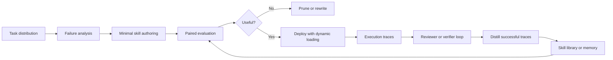
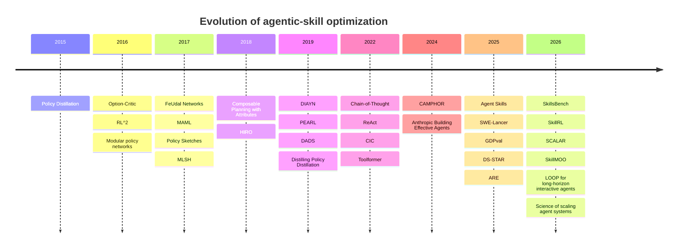

# Optimizing Agentic Skills

## Executive summary

Across both the academic literature and the official research output of Anthropic, OpenAI, Google, Meta, Apple, and Amazon, the strongest recurring conclusion is that **effective agentic skills are modular, minimal, evaluable, and dynamically invoked rather than monolithic, static, or purely prompt-based**. Recent LLM-agent work such as SkillsBench shows that curated skills can materially improve pass rates, but that gains are highly task-dependent, self-generated skills are weak on average, and *focused* skills beat bloated documentation bundles. Classic RL and meta-learning work arrives at a parallel conclusion from a different angle: temporally extended abstractions, modular subpolicies, and learned adaptation procedures improve long-horizon efficiency when they are grounded in clear interfaces and objective feedback. citeturn7view1turn13search0turn8search0turn8search1turn8search2turn10search1

If the goal is to build the **fastest** skills, the evidence points away from “more instructions everywhere” and toward **context economy and representation alignment**: keep skill bundles small, load context just in time, align observation/action representations to the model’s pretraining distribution, compress prompts or share parameters when possible, and distill or reuse experience instead of replaying raw trajectories. Anthropic’s context-engineering guidance, Apple’s CAMPHOR and reviewer-agent work, Amazon’s AgentOccam and Agent-EvalKit, and policy distillation papers all support the same operational rule: **reduce unnecessary tokens, tool ambiguity, and interface friction first**. citeturn27view3turn30view0turn30view1turn31view0turn26view5turn9search3turn12search2

If the goal is to build the **smartest** skills, the evidence favors a layered architecture: reasoning traces or plans, tool/skill selection, structured execution, and explicit review or verification. Google’s ReAct and chain-of-thought work show why reasoning decomposition matters; Apple, Amazon, Anthropic, and OpenAI all emphasize that the real performance bottleneck in deployed agents is often not raw model IQ but the combination of harness design, tool specification, long-horizon recovery, and evaluation discipline. citeturn28view0turn28view1turn27view2turn30view1turn31view1turn32view0turn25view2

The central debate is **not** whether agents need skills; it is **which skills should be learned, how they should be represented, and when they should be optimized through prompting, search, distillation, or RL**. SkillsBench argues that unguided self-authored skills do not help much on average, while SkillRL, SCALAR, SkillMOO, Apple’s RL-for-interactive-agents work, and Amazon’s RL customization work show that **feedback-grounded skill evolution can work well** when the environment provides verifiable signals, concrete tools, or deterministic graders. The synthesis is practical: **use lightweight skill authoring and paired evaluation first; escalate to reviewer loops, search-based skill optimization, distillation, or RL only when your environment can score outcomes reliably**. citeturn7view1turn13search1turn13search6turn13search11turn26view4turn31view1

The most robust blueprint that emerges from the sources is this: define a small, explicit skill unit; pair it with deterministic or rubric-based evaluation; optimize for pass rate, latency, cost, and harmfulness together; use hierarchy only where tasks truly decompose; and continuously compress successful traces into reusable abstractions. That is the strategy most likely to yield skills that are simultaneously **effective, fast, and adaptive**. citeturn7view1turn27view1turn27view2turn26view5turn26view0turn29view1

## What optimized agentic skills look like

A useful way to unify the literature is to view an “agentic skill” as a reusable package that sits between raw model reasoning and low-level execution. In recent industry language, that package may be a folder of instructions, scripts, and resources discovered at runtime; in classical RL, it may be an option, subpolicy, or latent behavior; in meta-learning, it may be an initialization or adaptation mechanism; and in modern LLM-agent systems, it may also include retrieval logic, verifiers, reviewers, or memory. Despite different vocabulary, the optimization problem is remarkably consistent: **maximize task completion under constraints of latency, token budget, tool accuracy, recoverability, and generalization**. citeturn26view2turn8search0turn8search1turn10search0turn10search1turn25view0

The figure above matches the strongest research-backed loop. Contemporary skill work stresses **paired before/after evaluation**, dynamic loading, and iterative revision; Anthropic emphasizes simple composable patterns, clear tool boundaries, and just-in-time context retrieval; Apple and Amazon add reviewer agents and layered measurements; and recent academic skill-evolution papers add distillation, search, and RL to improve the skill library over time. citeturn7view1turn27view0turn27view1turn27view3turn30view1turn26view5turn13search1turn13search3

The main levers are summarized below.

| Optimization target | Lever with strongest support | Why it works | Representative sources |
|---|---|---|---|
| Higher success rate | Focused, domain-specific skills with explicit boundaries | Smaller, clearer bundles reduce ambiguity and improve retrieval/use at inference time | SkillsBench; SkillMOO; Anthropic Agent Skills; Anthropic context engineering citeturn7view1turn13search11turn26view2turn27view3 |
| Lower latency and token cost | Minimal tool sets, prompt compression, observation/action alignment, distillation | Agents waste time when tools overlap, context is bloated, or action spaces are unnatural | CAMPHOR; AgentOccam; Policy Distillation; Anthropic writing tools citeturn30view0turn31view0turn9search3turn27view1 |
| Better long-horizon reliability | Hierarchy plus review/verifier loops | Decomposition helps planning; reviewer agents catch execution errors before they propagate | FeUdal; HIRO; Apple Reinforced Agent; Anthropic evals citeturn8search1turn8search2turn30view1turn27view2 |
| Better generalization | Modular policies, meta-learning, reusable skill libraries | Recombination and fast adaptation transfer better than per-task monoliths | Policy Sketches; Learning Modular Policies; RL^2; PEARL; SkillRL citeturn12search3turn14search0turn10search0turn10search1turn13search1 |
| Better personalization | Explicit memory plus feedback loops | User preferences drift; static prompts and one-shot training do not keep up | PAHF; Anthropic context engineering citeturn29view1turn27view3 |
| Better safety and trustworthiness | Multi-layer grading, faithfulness checks, human escalation on uncertainty | Good-looking outputs can still be wrong or fabricated | OpenAI deep research system card; Agent-EvalKit; Anthropic evals; Amazon grounding citeturn25view2turn26view5turn27view2turn26view6 |

A second useful summary is historical. The field moved from **compressing policies**, to **learning reusable abstractions**, to **using tools and reasoning traces**, and then to **measuring and evolving skills explicitly**. That progression matters because it explains why current best practice is neither “just prompt better” nor “just train harder,” but rather **treat skills as optimization objects in their own right**. citeturn9search3turn8search0turn8search1turn12search3turn28view0turn29view0turn7view1turn13search0

## Academic primary sources

Dates below are exact when surfaced by the official page or arXiv/OpenReview entry; otherwise the year and venue are given. The citation in the source cell is the direct link.

| Source and publication date | Problem focus | Methods | Datasets and metrics | Key results and why they matter |
|---|---|---|---|---|
| **SkillsBench** — arXiv v4 dated 2026-06-14 citeturn7view1turn16view0 | Benchmarking inference-time agent skills | Paired evaluation of no-skills, curated-skills, and self-generated-skills conditions with deterministic verifiers | 87 tasks across 8 domains; 18 model–harness configs; pass rate, skill lift, normalized gain | Curated skills raise average pass rate from 33.9% to 50.5%; focused skills with at most three modules outperform larger bundles; smaller models with skills can match larger models without them. This is the strongest current evidence that skill **quality and granularity** dominate raw bundle size. citeturn7view1 |
| **Agent Skill Evaluation and Evolution** — 2026-06-09 citeturn13search0 | Survey of skill lifecycle beyond authoring | Taxonomy of execution-feedback, trajectory-distillation, compression, and RL-based evolution; survey of benchmark categories | Survey/benchmark review rather than a single dataset; focuses on benchmark coverage and metric richness | The paper argues the field is shifting from static skill creation to **evaluation-driven skill evolution**, and identifies benchmark gaps in efficiency, safety, and generalizability measurement. Useful as a map of the space. citeturn13search0 |
| **SkillRL** — 2026-02-09 citeturn13search1 | Turning raw trajectories into reusable LLM-agent skills | Experience-based distillation into a hierarchical SkillBank; adaptive retrieval; recursive evolution during RL | ALFWorld, WebShop, and seven search-augmented tasks; performance vs. baselines, robustness, token footprint | Reports state-of-the-art performance, beating strong baselines by more than 15.3% while reducing token footprint. Strong support for **abstraction over raw memory**. citeturn13search1 |
| **SCALAR** — 2026-03-10 citeturn13search6 | Composing language-proposed skills with grounded RL | LLM proposes skills with preconditions/effects; RL trains policies; bidirectional feedback refines the symbolic skill specs | Craftax; task success and sample efficiency | Achieves 88.2% diamond collection, a 1.9× improvement over the best baseline, and reaches settings where prior methods fail. Strong case for **LLM planning + RL grounding** rather than one-shot skill generation. citeturn13search6 |
| **SkillMOO** — 2026-04-10 citeturn13search11 | Automated skill-bundle optimization | LLM-proposed edits plus NSGA-II Pareto selection over pass rate and cost | Software-engineering tasks from SkillsBench; pass rate, cost, runtime | Improves pass rate by up to 131% while reducing cost by up to 32% relative to the best baseline per task. Strong evidence that skill optimization should be **multi-objective**, not accuracy-only. citeturn13search11 |
| **The Option-Critic Architecture** — 2016-09-16 citeturn8search0 | End-to-end option learning | Learns option policies, terminations, and policy-over-options jointly via policy gradients | Discrete and continuous environments; return and learning efficiency | Foundational result: options can be learned without hand-specified subgoals or extra rewards, making temporal abstraction trainable rather than manually engineered. citeturn8search0 |
| **FeUdal Networks** — 2017-03-03 citeturn8search1 | Long-horizon hierarchical RL | Manager/Worker hierarchy with different temporal resolutions and goal vectors | Atari and DeepMind Lab; game score and long-horizon performance | Dramatically outperforms a strong baseline on tasks with long-term credit assignment or memorization. Strong support for **multi-timescale decomposition**. citeturn8search1 |
| **HIRO** — 2018-05-21 | Data-efficient HRL citeturn8search2 | Off-policy hierarchical RL with off-policy correction for changing lower-level behavior | Simulated robotic control, including object pushing and navigation; sample efficiency, return | Learns complex robot behaviors in only a few million samples and substantially outperforms prior HRL methods. Important for the claim that hierarchy can be **sample efficient**, not just expressive. citeturn8search2 |
| **DIAYN** — 2018-02-16 citeturn9search0 | Unsupervised skill discovery | Maximizes an information-theoretic diversity objective with maximum-entropy RL | Simulated robotic tasks and downstream sparse-reward transfer; diversity and downstream task performance | Learns diverse behaviors without extrinsic reward, and discovered skills can solve downstream tasks and be composed hierarchically. Core evidence that pretraining skills can improve exploration and transfer. citeturn9search0 |
| **DADS** — 2019-07-02 / ICLR 2020 citeturn9search1turn9search9 | Predictable skill discovery for planning | Learns skills whose outcomes are easy to model; combines skill discovery with learned dynamics | Zero-shot planning in latent skill space; sparse-reward tasks; planning performance | Zero-shot planning in learned skill space outperforms standard model-based RL and goal-conditioned RL. Strong argument for skills optimized for **predictability**, not just diversity. citeturn9search1 |
| **CIC** — NeurIPS 2022 citeturn14search2turn14search6 | Competence-based unsupervised skill discovery | Contrastive objective maximizing mutual information between skills and state transitions while encouraging state entropy | URLB; exploration and downstream performance | Achieves leading performance on the Unsupervised RL Benchmark, helping rehabilitate competence-based skill learning. Important update to the DIAYN lineage. citeturn14search6 |
| **Modular Multitask RL with Policy Sketches** — 2016-11-06 / ICML 2017 citeturn12search3turn12search11 | Learning reusable subpolicies from weak structure | Supervises tasks with sequences of named subtasks but does not specify how to execute them | Three sparse-reward environments with discrete and continuous control; reward and transfer | Beats existing shared-policy and task-specific baselines, while inducing an interpretable library of primitive behaviors that can be recombined on new tasks. Strong support for weakly supervised modularity. citeturn12search3 |
| **Composable Planning with Attributes** — 2018-03-01 citeturn12search1turn12search5 | Compositional planning over abstractions | Learns attribute transitions and plans paths through attribute space | 3D block stacking, grid-world, StarCraft; task success and generalization | Generalizes from short/simple training tasks to longer/more complex test-time tasks via composition. Important for skill libraries that need to solve unseen compositions. citeturn12search1 |
| **RL^2** — 2016-11-09 citeturn10search0turn10search10 | Fast adaptation as learned learning | Encodes the fast RL algorithm in an RNN; learns it with slow RL | Multi-armed bandits, finite MDPs, vision-based navigation; regret/return | Achieves near-hand-designed performance on small problems and scales to high-dimensional navigation. A foundational meta-learning result for fast skill adaptation. citeturn10search0 |
| **MAML** — 2017-03-09 / ICML 2017 citeturn11search0turn11search1 | Fast adaptation from a good initialization | Model-agnostic bilevel optimization for quick fine-tuning | Omniglot, MiniImageNet, regression, RL policy-gradient tasks; accuracy and adaptation efficiency | Achieves strong few-shot results and accelerates RL fine-tuning. Important because many “skills” are really **adaptation priors**. citeturn11search0 |
| **PEARL** — 2019 / ICML 2019 citeturn10search1turn10search4turn10search11 | Sample-efficient off-policy meta-RL | Latent probabilistic context variable disentangling task inference from control | Continuous-control meta-RL; return and sample efficiency | Reports 20–100× higher sample efficiency than prior meta-RL baselines while matching or exceeding final performance. Strong evidence for **off-policy adaptation**. citeturn10search11 |
| **Meta Learning Shared Hierarchies** — 2017-10-26 citeturn10search2turn14search7 | Shared primitives across task families | Learns a set of subpolicies shared across tasks and a task-specific master policy | Maze navigation, obstacle courses, walking/crawling robots; reward and transfer | Discovers meaningful shared primitives that transfer to unseen long-timescale sparse-reward tasks. Good bridge between hierarchy and meta-learning. citeturn10search2 |
| **Learning Modular Neural Network Policies for Multi-Task and Multi-Robot Transfer** — 2016-09-22 citeturn14search0turn14search12 | Compositional transfer across tasks and embodiments | Decomposes policy into robot-specific and task-specific modules | Visual and non-visual robot simulation tasks; zero-shot generalization | Mix-and-match modules solve unseen robot–task combinations during transfer. Strong support for separating **skill content** from **execution substrate**. citeturn14search0 |
| **Policy Distillation** — 2015-11-19 citeturn9search3turn9search7 | Compressing and combining policies | Supervised distillation from teacher RL policies into smaller or multitask students | Atari; score, model size, efficiency | Produces expert-level students that are dramatically smaller and more efficient; multitask distilled agents outperform single-task teachers and jointly trained baselines. The foundational case for **skill compression**. citeturn9search3 |
| **Distilling Policy Distillation** — 2019-02-06 / AISTATS 2019 citeturn12search2turn12search6 | Which distillation objective is best? | Theoretical and empirical comparison of distillation variants; proposes entropy-regularized formulation | RL distillation settings; learning speed and convergence behavior | Shows that small formulation changes can drastically change performance and identifies preferred techniques by setting. Important warning for agent-skill distillation pipelines. citeturn12search2 |

## Industry primary sources

This section prioritizes official company research pages, engineering blogs, system cards, and company-authored papers.

| Source and publication date | Company | Methods and framing | Datasets and metrics | Key results and practical value |
|---|---|---|---|---|
| **Building effective agents** — 2024-12-19 citeturn27view0 | Anthropic | Distinguishes workflows from agents; advocates simplest viable design first | Production experience rather than a benchmark paper | Argues successful systems use simple, composable patterns; recommends escalating from single calls to workflows to agents only when needed. This is one of the clearest anti-overengineering statements in industry practice. citeturn27view0 |
| **Equipping agents for the real world with Agent Skills** — 2025-10-16 citeturn26view2 | Anthropic | Introduces skills as organized folders of instructions, scripts, and resources discovered and loaded dynamically | Operational framing; qualitative performance and security implications | Formalizes skill packaging for LLM agents and notes that filesystem/code-execution agents do not need the full skill in context up front, making effective bundled knowledge “unbounded” if loaded progressively. citeturn26view2 |
| **Writing effective tools for agents** — 2025-09-11 citeturn27view1 | Anthropic | Tool ergonomics, namespacing, token-efficient responses, prototyping, and agent-assisted tool optimization | Emphasizes comprehensive evaluations grounded in realistic multi-tool tasks | The central message is that agents are only as effective as their tools, and tool interfaces should be designed for agents, not just humans or APIs. Strong support for **interface optimization** as a first-class research target. citeturn27view1 |
| **Effective context engineering for AI agents** — 2025-09-29 citeturn27view3 | Anthropic | Minimal prompts, canonical examples, just-in-time retrieval, tight tool design | Operational guidance for long-horizon agents | Recommends the minimal set of information that fully specifies behavior, minimal viable toolsets, and dynamic context retrieval. This closely matches the conclusions of SkillsBench and SkillMOO. citeturn27view3 |
| **Demystifying evals for AI agents** — 2026-01-09 citeturn27view2 | Anthropic | Layered evaluation with code-based, model-based, and human graders; capability and regression evals | General agent evaluation framework | Makes the load-bearing claim that agent evaluation is really evaluation of **model + harness**, and that graders should be mixed according to task subjectivity and cost. Critical for rigorous skill iteration. citeturn27view2 |
| **New tools for building agents** — 2025-03-11 citeturn32view0 | OpenAI | Responses API, built-in web/file/computer-use tools, Agents SDK, observability | Platform primitives rather than benchmark scores | Frames production agent building as a tooling and orchestration problem, not just a model-selection problem. Strong support for traceability and observability as optimization requirements. citeturn32view0 |
| **Introducing the SWE-Lancer benchmark** — 2025-02-18 citeturn25view1 | OpenAI | Real-world freelance software-engineering benchmark with end-to-end grading and managerial judgments | 1,400+ Upwork tasks valued at $1M; end-to-end tests and manager judgments | Finds frontier models still unable to solve most tasks. An important reminder that open-ended coding capability does not automatically imply robust skill execution in real environments. citeturn25view1 |
| **Deep research system card** — 2025-02-25 citeturn25view2 | OpenAI | System-card analysis of a browsing, reasoning, code-executing research agent | Risk dimensions include prompt injection, privacy, hallucinations, code execution, autonomy | Treats browsing agents as systems requiring new mitigations beyond model alignment; highlights prompt-injection resistance and privacy protections as central design constraints for capable skills. citeturn25view2 |
| **GDPval** — 2025-09-25 citeturn32view1 | OpenAI | Evaluation of economically valuable knowledge-work tasks | 44 occupations across 9 industries; 1,320 tasks; expert blind grading | Moves evaluation from narrow academic benchmarks to real work products like briefs, diagrams, spreadsheets, and multimedia. This is important because skill usefulness must be measured on real deliverables, not only toy tasks. citeturn32view1 |
| **ReAct** — 2022-11-08 blog summary of the paper citeturn28view0 | Google | Interleaves reasoning traces and actions | HotpotQA, interactive decision-making, navigation-style settings; task success and interpretability | Shows that reasoning+acting outperforms reason-only or act-only prompting, while improving interpretability and controllability. Foundational for skill pipelines that must both plan and act. citeturn28view0 |
| **Chain-of-thought prompting** — 2022 official Google Research blog summary citeturn28view1 | Google | Prompting with intermediate reasoning steps | GSM8K, MultiArith, commonsense benchmarks; accuracy | Reports PaLM 540B + CoT at 58% on GSM8K, later 74% with self-consistency, and strong gains on sports understanding. Important because good skills often require explicit intermediate structure before tool/skill execution. citeturn28view1 |
| **AI co-scientist** — 2025-02-19 citeturn26view1 | Google | Multi-agent scientific collaborator for generating and refining hypotheses | Scientific literature and proposal-generation workflows | Positions multi-agent systems as a way to mirror scientific reasoning and cross-domain synthesis. Valuable evidence that specialized agents help most when the task naturally decomposes into ideation, critique, and refinement. citeturn26view1 |
| **DS-STAR** — 2025-11-06 citeturn28view2 | Google | Iterative plan–verify–route cycle for data-science agents | DABStep, KramaBench, DA-Code; normalized accuracy; ablations | Improves accuracy from 41.0% to 45.2% on DABStep, 39.8% to 44.7% on KramaBench, and 37.0% to 38.5% on DA-Code; ablations show rich data context and routing matter. Strong support for verifier/router loops. citeturn28view2 |
| **Towards a science of scaling agent systems** — 2026-01-28 citeturn26view0 | Google | Controlled evaluation of 180 agent configurations and definition of “agentic” tasks | Large-scale configuration study; agentic task properties and configuration performance | Challenges the heuristic that “more agents are better,” showing multi-agent scaling can hit ceilings or degrade if misaligned with task properties. One of the most important counterweights to agent-graph inflation. citeturn26view0 |
| **Toolformer** — 2023-02-09 arXiv; Meta research page official citeturn35search0turn29view0 | Meta | Self-supervised API-use learning from a few demonstrations | Downstream zero-shot tasks involving calculator, search, translation, QA, calendar APIs | Learns when to call tools, how to pass arguments, and how to use results, achieving improved zero-shot performance often competitive with much larger models. Foundational for self-supervised tool-skill acquisition. citeturn29view0turn35search0 |
| **Collaborative Reasoner** — 2025-04-17 citeturn29view3 | Meta | Evaluates and improves collaborative reasoning using synthetic conversations; builds Matrix framework | Five collaborative reasoning tasks; improvements over single-agent CoT | Finds current models cannot reliably benefit from collaboration by default, then shows synthetic interaction training yields gains up to 29.4% over equivalent single-agent CoT. Supports selective, trained collaboration rather than naive multi-agent use. citeturn29view3 |
| **ARE and Gaia2** — 2025-09-22 citeturn26view3 | Meta | Platform for building agent environments and verifiers; benchmark for async, noisy, dynamic agent tasks | Meta ARE platform and Gaia2 benchmark | Emphasizes asynchronous, ambiguity-rich environments with explicit rules, tools, and verifiers, surfacing failures that static benchmarks miss. Crucial for evaluation realism. citeturn26view3 |
| **Learning Personalized Agents from Human Feedback** — 2026-02-26 citeturn29view1 | Meta | Three-step loop: clarification, memory-grounded action, post-action update | Embodied manipulation and online shopping; personalization error and adaptation speed | Shows explicit memory plus dual feedback channels improves both initial personalization and adaptation to preference shifts. Important for user-specific skill optimization. citeturn29view1 |
| **CAMPHOR** — published 2024 on Apple research page citeturn30view0 | Apple | On-device multi-agent SLM with hierarchical decomposition, parameter sharing, and prompt compression | Novel personalized assistant trajectory dataset; task-completion F1 | Fine-tuned small on-device agents outperform closed-source LLMs by 35% task-completion F1 while improving privacy and eliminating server communication. Strong proof that **smaller, well-structured skill systems can beat larger generic models**. citeturn30view0 |
| **COMPASS** — published 2025-12 on Apple research page citeturn22view0 | Apple | Benchmark for constrained multi-turn planning and preference optimization | Travel-planning database, multi-service tools; acceptable-optimal gap and coordination gap | Finds agents often satisfy hard constraints but fail to optimize soft preferences, and multi-service coordination collapses performance. This is a very practical benchmark lesson: success is more than “not failing.” citeturn22view0 |
| **Reinforced Agent** — 2026-05 citeturn30view1 | Apple | Specialized reviewer agent evaluates provisional tool calls before execution | BFCL and τ2-Bench; helpfulness, harmfulness, irrelevance detection, multi-turn task performance | Reports +5.5% on irrelevance detection and +7.1% on multi-turn tasks, with helpfulness/harmfulness ratios that vary by reviewer model. Excellent evidence for **inference-time review** rather than post-hoc patching. citeturn30view1 |
| **Reinforcement Learning for Long-Horizon Interactive LLM Agents** — 2026 citeturn26view4 | Apple | LOOP RL for interactive digital agents in stateful API environments | AppWorld; task completion relative to strong baselines | A 32B agent trained with LOOP beats a much larger OpenAI o1 agent by 9 percentage points in AppWorld and learns to consult docs, avoid assumptions, and recover from setbacks. This is strong evidence that RL with verifiable environment signals can materially improve agent skills. citeturn26view4 |
| **AgentOccam** — ICLR 2025 / Amazon Science publication page citeturn31view0 | Amazon | Simplifies observation and action spaces to align them with LLM strengths | WebArena and WebVoyager; success rate | Beats the prior SOTA by +9.8 absolute points on WebArena and improves success by +26.6 points over plain web agents, without extra roles, in-context examples, or search strategies. Best current industry evidence that **interface design beats scaffold bloat**. citeturn31view0 |
| **Customizing multiturn AI agents with reinforcement learning** — 2026-01-13 citeturn31view1 | Amazon | RL customization with online simulator, verifiable ground-truth rewards, actor–critic training | AppWorld and agentic-RAG setups; task success and exact/semantic accuracy | Shows RL-based customization can significantly boost task success even with small models and small training datasets when rewards are verifiable. Closely aligned with Apple’s LOOP result. citeturn31view1 |
| **Agent-EvalKit** — 2026-06-11 citeturn26view5 | Amazon AWS | End-to-end evaluation pipeline for agents with task generation and trace capture | 100 multi-turn travel-agent sessions; faithfulness, tool-parameter accuracy, response quality | In the demo, response quality was 83.9%, tool-parameter accuracy 64.5%, but faithfulness only 32.3%, exposing fabricated details despite plausible answers. This is a powerful reminder that apparent usefulness can hide broken skills. citeturn26view5 |
| **Real-world grounding in agentic AI** — 2026-06-08 citeturn26view6 | Amazon | Four grounding approaches: physics-guided learning, uncertainty-aware reasoning, adapting-while-learning, verifier-augmented grounding | Physical-science and operational agent settings; accuracy and trustworthiness | Reports that AWL achieves 29% higher accuracy on physical-science datasets and argues for uncertainty-triggered human intervention and verifier loops in high-stakes physical settings. Important extension beyond purely digital agents. citeturn26view6 |

## Synthesized findings across sources

The clearest commonality is that **skills should be explicit artifacts with narrow interfaces and measurable effects**. SkillsBench, Anthropic’s Agent Skills and context-engineering work, Apple’s CAMPHOR, Amazon’s AgentOccam, and the modular-policy literature all converge on the same principle: small, composable units with clear inputs, outputs, and retrieval boundaries outperform sprawling bundles or hand-built mega-scaffolds. In academic RL terms, this appears as options, sketch-guided subpolicies, modular robot/task networks, and attribute-conditioned transitions; in industry terms, it appears as focused skills, namespaced tools, prompt compression, and dynamic loading. citeturn7view1turn26view2turn27view3turn30view0turn31view0turn12search3turn14search0turn12search1

A second broad commonality is that **good skill systems are evaluation-first systems**. SkillsBench uses matched conditions and deterministic verifiers; Anthropic argues for mixed graders and capability/regression evals; Amazon’s Agent-EvalKit exposes hidden faithfulness failures; Apple’s Reinforced Agent introduces helpfulness/harmfulness to quantify review tradeoffs; Meta’s ARE and OpenAI’s GDPval both try to move evaluation toward more realistic, asynchronous or work-product-based tasks. The cross-source lesson is that optimizing only end-task pass rate is insufficient; you need to monitor at least some combination of outcome correctness, faithfulness, tool accuracy, cost, latency, and damage from attempted improvements. citeturn7view1turn27view2turn26view5turn30view1turn26view3turn32view1

A third commonality is that **hierarchy helps when horizons are long and subgoals are real**. FeUdal Networks, HIRO, MLSH, Policy Sketches, CAMPHOR, ReAct, and AI co-scientist all assume that solving the full task in one flat step space is inefficient or brittle. But they also imply a boundary condition: hierarchy helps when the task actually decomposes into reusable intermediate decisions, and when those decisions can be represented or learned stably. citeturn8search1turn8search2turn10search2turn12search3turn30view0turn28view0turn26view1

A fourth commonality is that **experience should be compressed into reusable abstractions, not left as raw transcripts**. SkillRL, policy-distillation work, Anthropic’s context engineering, CAMPHOR, and OpenAI’s platform framing all reinforce the same engineering idea: store or train on the compressed thing that matters. That can be a distilled policy, a learned context variable, a retrieved skill bundle, a compact tool contract, or a prompt-compressed on-device library. The purpose is the same: improve reuse while reducing inference friction. citeturn13search1turn9search3turn12search2turn27view3turn30view0turn32view0

Some findings appear only in a smaller subset of sources, and they are important precisely because they are distinctive. **Personalization** is developed most explicitly in Meta’s PAHF, which formalizes the loop of clarification, memory-grounded action, and post-action update; most other sources acknowledge user context, but PAHF is unusually concrete about evolving preferences and explicit per-user memory. **Inference-time reviewer agents** are most sharply developed in Apple’s Reinforced Agent, which turns tool-call review into a measurable helpfulness-vs-harmfulness trade-off. **Physical grounding** is emphasized most clearly in Amazon’s 2026 grounding note, which extends agent design beyond information work into operational environments where hallucinations violate physical laws. **Self-improving meta-agents** are most visible in Meta’s HyperAgents, which pushes beyond improving task behavior to improving the improvement process itself. citeturn29view1turn30view1turn26view6turn29view2

The main disagreements or open debates are more nuanced than simple contradictions. The first concerns **multi-agent scale**. Google’s scaling study argues that adding agents often hits a ceiling and can even degrade performance if the task does not benefit from decomposition or parallelism, while Google’s AI co-scientist, Anthropic’s multi-agent research system, Meta’s Coral, and Apple’s CAMPHOR show that multiple agents can help substantially on tasks involving debate, decomposition, or specialized subroles. The tension resolves to a conditional rule: use multiple agents when the task graph truly factorizes, not as a default aesthetic. citeturn26view0turn17search9turn29view3turn30view0

The second debate concerns **self-authored skill creation versus feedback-grounded skill evolution**. SkillsBench finds that self-generated skills provide no average benefit, suggesting that current models are poor at writing generally useful skills unaided. By contrast, SkillRL, SCALAR, SkillMOO, HyperAgents, Apple’s LOOP work, and Amazon’s RL-customization work all report positive results from automatically improving or discovering skills. The contradiction is only apparent: the successful systems add strong grounding signals—RL rewards, search, execution feedback, optimization objectives, or explicit verifiers—whereas unguided skill writing alone is weak. citeturn7view1turn13search1turn13search6turn13search11turn29view2turn26view4turn31view1

The third debate concerns **prompting/scaffolding versus training**. Anthropic and OpenAI are comparatively conservative: start with the simplest pattern, better tools, better context, and better evals before attempting more elaborate training. Apple, Amazon, and several academic papers show that RL can create large gains in stateful, long-horizon environments when the reward is verifiable. The synthesis is pragmatic. If the environment cannot grade behavior reliably, optimization should stay near prompt/tool/harness design; if the environment *can* grade behavior reliably, RL or evolutionary search becomes much more attractive. citeturn27view0turn27view1turn27view3turn32view0turn26view4turn31view1turn10search1

A final open debate concerns **what metrics should be primary**. Legacy benchmarks often privilege pass/fail correctness or return. Recent sources argue for richer objective functions: SkillMOO optimizes pass rate and cost; Apple introduces helpfulness and harmfulness; Amazon isolates faithfulness from response quality; Anthropic distinguishes capability from regression; GDPval broadens the target to real work products. This is not just evaluation philosophy. It changes what kinds of skills get selected: broad but expensive bundles, or reviewer agents that fix some errors while introducing others, may look good under one metric and bad under another. citeturn13search11turn30view1turn26view5turn27view2turn32view1

## Practical blueprint for building the most effective, fastest, smartest skills

The best-supported design rule is to begin by defining **the smallest skill unit that a strong evaluator can actually measure**. In practice that usually means one specific procedure, one clear tool family, or one compact bundle of instructions plus scripts. SkillsBench and SkillMOO both show that smaller, focused bundles often outperform large accreted bundles, while Anthropic’s tool and context guidance reaches the same point from production experience. citeturn7view1turn13search11turn27view1turn27view3

The second rule is to **optimize the interface before optimizing the weights**. Rename or split ambiguous tools, reduce overlapping functionality, compress prompts, align action and observation space formats to the model’s strengths, and return only the context the agent can actually use. CAMPHOR, AgentOccam, Anthropic’s tool-design guidance, and policy distillation all indicate that huge performance is often hidden in interface cleanup and compression rather than in brute-force model scaling. citeturn30view0turn31view0turn27view1turn9search3

The third rule is to use **paired and layered evaluation** from day one. Measure not only end-task success, but also faithfulness, tool-parameter accuracy, harmful regressions, runtime, and token cost. If the task is open-ended, use a mix of deterministic graders, rubric-based model graders, and human spot checks. This is one of the few conclusions that is simultaneously backed by recent benchmark design, industry system cards, and engineering guidance. citeturn7view1turn27view2turn26view5turn30view1turn25view2

The fourth rule is to introduce **hierarchy only where the world has hierarchy**. A manager–worker decomposition, skill router, or multi-agent debate system is high leverage for long-horizon, partially observable, multi-service, or multi-domain tasks. It is much less helpful for simple deterministic jobs. Google’s scaling work and Anthropic’s architecture guidance are the strongest warnings against gratuitous decomposition, while FeUdal, HIRO, ReAct, AI co-scientist, and CAMPHOR show where it pays off. citeturn26view0turn27view0turn8search1turn8search2turn28view0turn26view1turn30view0

The fifth rule is to escalate from prompt engineering to **search, distillation, or RL only when you have verifiable feedback**. If you can deterministically score the outcome, check tool calls, or compare deliverables against ground truth, optimization methods become much more reliable. That is exactly the regime where SkillRL, SCALAR, SkillMOO, Apple’s LOOP, and Amazon’s RL customization succeed. When such signals are absent, the safer high-ROI path is better tools, better context, better review, and better evaluation. citeturn13search1turn13search6turn13search11turn26view4turn31view1turn27view1

The sixth rule is to give the agent **a reviewer, a verifier, or both** whenever tool calls are consequential. Apple’s reviewer-agent results, Amazon’s faithfulness findings, Meta’s ARE design, and Anthropic’s evaluation guidance all indicate that one of the fastest routes to better agent skills is not more base-agent cleverness but more disciplined in-loop checking. For high-stakes settings, uncertainty-triggered human intervention should be part of the skill contract. citeturn30view1turn26view5turn26view3turn27view2turn26view6

The seventh rule is to treat **memory carefully**. Storing raw transcripts or huge static knowledge dumps is often inferior to storing reusable abstractions, explicit preferences, or compact artifacts that can be selectively loaded. PAHF is the clearest evidence on user preference memory; SkillRL makes the same point for trajectory memory; Anthropic’s just-in-time retrieval guidance generalizes it to production engineering. citeturn29view1turn13search1turn27view3

The final rule is to optimize for **a Pareto frontier, not a single headline score**. The best skill system is rarely the one with the highest pass rate at any cost; it is the one that hits the best frontier of success, latency, cost, faithfulness, and safety for your task class. That conclusion is not incidental. It appears independently in SkillMOO’s optimization setup, Apple’s helpfulness/harmfulness framing, Amazon’s quality-vs-faithfulness split, Anthropic’s regression-eval advice, and the realism push behind GDPval and SWE-Lancer. citeturn13search11turn30view1turn26view5turn27view2turn32view1turn25view1

A concise implementation order, if one wants the highest expected return on research time, is therefore:

| Stage | What to do first | Why this stage comes before the next |
|---|---|---|
| Skill definition | Write minimal, tightly scoped skills with clear tool boundaries and canonical examples | Bloated bundles and ambiguous tools degrade everything downstream. citeturn7view1turn27view1turn27view3 |
| Measurement | Build paired evals with deterministic checks where possible, plus rubric or human grading where needed | Without this, you cannot tell whether a skill helps, hurts, or simply sounds better. citeturn7view1turn27view2turn26view5 |
| Interface optimization | Prune tools, compress prompts, align actions/observations, and add just-in-time context loading | This is often the fastest route to lower latency and higher reliability. citeturn30view0turn31view0turn27view3 |
| Review and verification | Add reviewer agents, verifiers, or uncertainty triggers | These catch error cascades early and expose hidden hallucination/faithfulness problems. citeturn30view1turn26view5turn26view6 |
| Experience compression | Distill successful trajectories into skills, memory, or smaller policies | Reusing abstractions beats replaying raw traces. citeturn13search1turn9search3turn12search2 |
| Learning-based optimization | Apply search or RL if your environment can score outcomes reliably | This is where the biggest additional gains appear, but only under strong feedback. citeturn13search6turn13search11turn26view4turn31view1 |
| Personalization and domainization | Add explicit preference memory and feedback channels for user- or org-specific skills | Static generic skills degrade in domains with evolving preferences. citeturn29view1turn26view2 |

Taken together, the literature and official company research support a simple but demanding thesis: **the best agentic skills are not just clever prompts, not just RL policies, and not just more tools. They are carefully bounded abstractions backed by rigorous evaluation, efficient interfaces, and feedback loops that improve them over time.** citeturn7view1turn27view0turn26view0turn30view1turn31view1