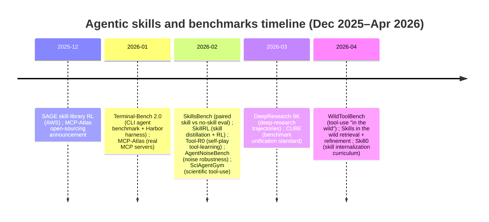
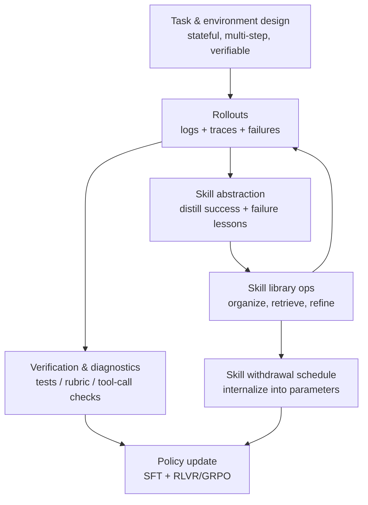
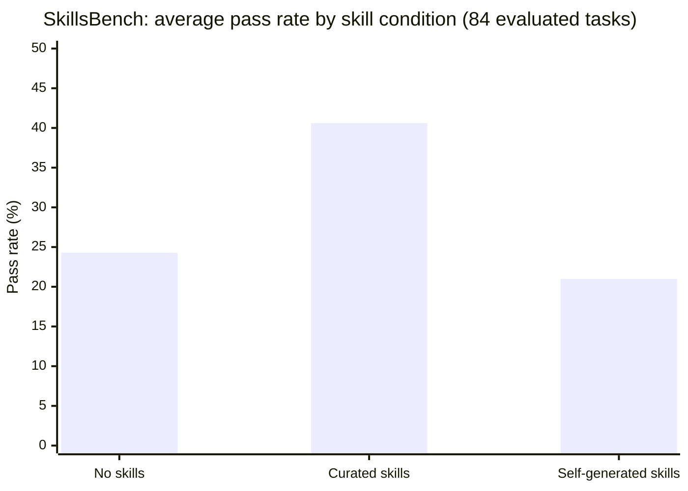
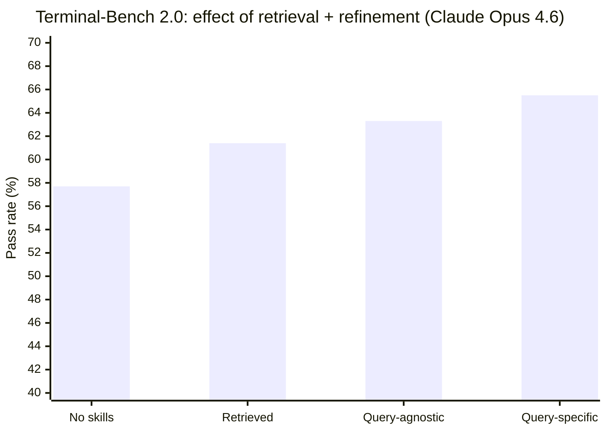

# Agentic Skills Research Review from December 2025 to April 2026

## Executive summary

“Agentic skills” research in this window converges on a practical thesis: **long-horizon agent performance improves most when procedural know-how becomes (a) explicit, modular, and testable, and (b) progressively transferred from external context into the agent’s policy through training curricula with reliable feedback**. The strongest evidence comes from controlled benchmark designs that isolate “skills” as an intervention (paired *with-skill* vs *without-skill*) and from RL-based training regimes that combine verifiable rewards with curriculum shaping and skill-library dynamics. citeturn5view1turn30view0turn15view0turn10view2turn11view0

A central empirical finding is that **human-curated skills (structured procedural artifacts) materially improve agent success rates, but the benefit is fragile under realistic retrieval noise and selection pressure**. In SkillsBench (86 tasks; 11 domains), curated skills increase average pass rate by **+16.2 percentage points**, with wide domain and task variance (including negative deltas on 16/84 evaluated tasks), while “self-generated” skills yield **negligible or negative** average benefit. citeturn5view1turn7view2 In a follow-on “skills in the wild” study, performance **degrades stepwise** as evaluation settings become more realistic (distractors → retrieval among 34k skills → retrieval without curated skills). The same paper shows that **query-specific skill refinement** can recover a substantial share of the lost performance when retrieval relevance is decent—for example, on Terminal-Bench 2.0 (89 CLI tasks), Claude Opus 4.6 improves from **57.7% (no skills)** to **65.5% (retrieved + query-specific refinement)** while also raising skill-loading rates. citeturn8view3turn9view2turn27view0

On the training side, the most consistently effective “agentic-skill” curricula share five properties:

1. **Verifiable, structured feedback**: deterministic tests or decomposed rubrics that reduce judge variance and enable RL at scale. SkillsBench and Terminal-Bench emphasize deterministic verification in containerized tasks; Tool-R0 and SAGE (AWS) explicitly design format + accuracy rewards; MCP-Atlas uses a “claims-based” rubric with partial credit plus internal diagnostics. citeturn7view2turn12view0turn10view2turn30view0turn16view2  
2. **Curriculum shaping around competence frontiers**: self-play or staged difficulty that keeps tasks neither trivial nor impossible. Tool-R0 co-evolves a generator and solver to propose tasks at the solver’s frontier; AWM and SciAgentGym synthesize diverse environments/trajectories; Skill0 begins with full skill context and progressively withdraws it (adaptive “helpfulness-driven” annealing). citeturn4view2turn26view3turn11view1turn15view0  
3. **Skill abstraction and compression**: distilling redundant trajectories into reusable “skills” (often hierarchical), reducing token footprint while preserving decision-relevant structure. SkillRL distills successes and failures into a hierarchical library and co-evolves skills with RL; Skill0 uses a tight context budget (<0.5k tokens/step) and even proposes compressing context into a compact visual representation during training. citeturn4view1turn15view0  
4. **Task chaining / transfer pressure**: curricula that force reuse and generalization across similar tasks, not just one-off success. SAGE trains on chains of similar tasks (“Sequential Rollout”) where skills accumulated earlier are needed later, yielding higher Scenario Goal Completion and improved efficiency (fewer steps/tokens). citeturn30view0  
5. **Robustness-oriented evaluation and training**: explicit stress tests for environmental noise, tool unreliability, and user ambiguity. AgentNoiseBench injects “user-noise” and “tool-noise,” finds consistent degradation and weak correlation between general reasoning ability and robustness; WildToolBench shows that *realistic user behavior* (compositional requests, hidden intent, instruction transitions) can collapse tool-use performance (no model >15% session accuracy in their evaluation). citeturn11view3turn17view0  

A complementary evaluation theme emerging in March 2026 is that **accuracy alone is an insufficient safety/quality indicator for agentic systems**. “Process evaluation” proposes **compliance checklists** to detect risky behaviors like step skipping, hallucinated tool use, or reliance on unverified parametric recall, and reports both compliance and answer accuracy to obtain a more holistic picture. citeturn20view0turn20view1turn20view2

Unspecified in the request (and therefore not assumed here): target user population, deployment context (e.g., enterprise vs consumer; online vs offline), and resource limits (other than “assume no compute/model-size constraints”). These materially affect curriculum design choices (e.g., latency budgets, sandbox hardness, acceptable tool permissions). citeturn20view1turn24view1turn16view2

## Scope and definitions

Time window: this review prioritizes primary sources published **from December 2025 through April 2026** (current date context: 2026-04-13, America/Los_Angeles). Sources are primarily peer-reviewed proceedings/accepted papers and arXiv preprints, plus official benchmark/framework documentation and technical reports where they function as “reference specs” for interoperable skill formats and evaluation harnesses. citeturn30view0turn17view0turn31view1turn23view0turn16view2

Working definition of **agentic skills** in this literature cluster: reusable procedural modules that guide or execute multi-step behavior across a class of tasks, typically including applicability cues/metadata, workflow policy, and termination criteria—distinct from atomic tools (single API calls) and from ephemeral plans (one-off decompositions). A formalized view appears in the SoK paper as a tuple capturing applicability, executable policy, termination, and callable interface, explicitly spanning representations from natural language “playbooks” to executable code and learned policies. citeturn22view0

Two major implementation paradigms are studied:

- **Inference-time skill augmentation** via structured filesystem artifacts (often a required `SKILL.md` with YAML frontmatter + optional scripts/references) that are discovered/loaded at runtime (“progressive disclosure”). citeturn5view1turn23view0turn24view0  
- **Skill internalization** via training curricula that start with skill context and progressively remove it so the competence transfers into model parameters, aiming for zero-shot behavior without retrieval overhead at inference. citeturn15view0  

The report necessarily blends three adjacent notions of “agentic skills”: (i) structured procedural artifacts (SkillsBench; Anthropic-style skills), (ii) skill libraries distilled from experience and used during RL (SkillRL; SAGE), and (iii) tool-use “competency” benchmarks that functionally measure agentic skill even when not framed as SKILL.md libraries (MCP-Atlas; WildToolBench; AgentNoiseBench). The connections are made explicit by papers that benchmark “skills” as artifacts, and by surveys/SoKs that map lifecycle stages (discovery → practice → distillation → retrieval → evaluation/update). citeturn5view1turn22view0turn16view1turn17view0

A high-level timeline of key work in this window (dates are submission/publication months in the cited sources): citeturn30view0turn31view1turn26view0turn26view1turn28view0turn17view0turn15view0turn20view2turn11view3turn14view0turn31view3

## Training approaches that improve agentic skills

### Skill augmentation is effective when skills are curated, modular, and evaluated with paired controls

SkillsBench is the clearest controlled evidence that “skills” (as structured procedural artifacts) can causally improve outcomes in multi-step agent tasks because it evaluates each task under **three conditions**: no skills, curated skills, and self-generated skills, and uses deterministic verifiers in containerized tasks. citeturn5view1turn7view2 The average improvement of **+16.2pp** pass rate with curated skills, contrasted with **~0 or negative** change for self-generated skills, implies that *what matters is not simply “more tokens of advice,” but expert-quality procedural guidance that models cannot reliably synthesize on demand*. citeturn5view2turn6view0

SkillsBench also surfaces content-structure correlates: “less is more”—**focused skills with 2–3 modules** outperform broad, comprehensive documentation; and “detailed/compact” skills beat “comprehensive” ones in a skill-complexity analysis. This suggests a training and curriculum implication: if you want models to learn/work agentically, you should train/evaluate on skill artifacts that (i) encode actionable procedures, (ii) are scoped to reusable subroutines, and (iii) minimize irrelevant context that competes with trajectory history in the agent’s window. citeturn6view0turn5view2

### Retrieval realism and refinement are pivotal; refinement behaves like a multiplier on initial retrieval relevance

A key limitation of “skills work” results is ecological validity: in production, agents rarely receive *exactly the right curated skills* without selection pressure. The April 2026 “skills in the wild” study operationalizes this by assembling **34k real-world skills** and evaluating progressively realistic conditions (curated + distractors → retrieval with curated skills included → retrieval with curated skills removed). Performance declines monotonically as realism increases, approaching no-skill baselines in the hardest setting, supporting the claim that “skill benefits are fragile.” citeturn8view1turn27view0

However, the same work identifies two mechanisms that meaningfully restore performance:

- **Agentic hybrid search** (iterative query formulation + candidate inspection) improves retrieval recall substantially compared to one-shot direct retrieval; in their study, agentic semantic/hybrid variants reach Recall@3 around **~57%** vs **~38%** for direct semantic search, with modest gains from indexing full skill content (not just metadata). citeturn9view2turn9view1  
- **Query-specific refinement**, which lets the agent explore the task before rewriting/merging retrieved skills, provides broad gains: on Terminal-Bench 2.0 it improves pass rates for three models (e.g., for Claude Opus 4.6: **61.4 → 65.5**), and on SkillsBench with curated skills in the pool it recovers much of the curated-skill gap (Claude: **40.1 → 48.2**). The paper explicitly reports that refinement effectiveness depends on the initial relevance/coverage of retrieved skills, reinforcing an important curriculum design point: *teach agents to retrieve well first; then refinement pays.* citeturn8view3turn8view2

### Reinforcement learning with skill libraries is most effective when training forces reuse across task chains

The December 2025 SAGE work (AWS) provides a strong example of skill-library training that enforces transfer: Sequential Rollout trains on **chains of similar tasks** where skills produced earlier accumulate and become useful later, and a skill-integrated reward adds incentives for high-quality skill generation/utilization on top of outcome-based rewards. On AppWorld, SAGE reports **+8.9% higher Scenario Goal Completion** while requiring **26% fewer interaction steps** and **59% fewer tokens**, and provides concrete baseline comparisons (e.g., on Test Normal: SAGE **60.7% SGC** vs GRPO baseline **51.8%**, with substantially fewer tokens/steps). citeturn30view0turn29search0

This result is particularly relevant to “agentic skills” because it indicates that *skill creation and skill use can be made learnable behaviors* when the training distribution creates repeated opportunities for reuse and when rewards explicitly value reusable abstractions, not just final-task success. citeturn30view0

### Skill distillation + hierarchical libraries + iterative evolution improve robustness and efficiency in RL-trained agents

SkillRL (Feb 2026) argues that naïve “store raw trajectories” memory is redundant/noisy and proposes an **experience-to-skill abstraction pipeline**: distill successes and failures into concise skills, organize them in a hierarchical library (“SkillBank”) with general vs task-specific skills, and **co-evolve** the skill library with the policy during RL using validation failures to refine skills. They report state-of-the-art performance with **>15.3% improvement over strong baselines** across ALFWorld, WebShop, and search-augmented tasks, alongside reduced token footprint. citeturn4view1turn26view1

Curricularly, SkillRL supports a structure where (i) rollouts generate diverse experiences, (ii) a teacher distills them into reusable “how-to” patterns, (iii) a cold-start SFT phase teaches the model to use these skills, and (iv) RL training continues with dynamic skill evolution. This is a concrete instantiation of “practice → distillation → storage/retrieval → re-practice,” aligning with the lifecycle framing in the SoK work. citeturn4view1turn22view0

### Skill internalization is promising for reducing inference overhead and eliminating retrieval noise, provided the curriculum withdraws skills adaptively

Skill0 (Apr 2026) targets a fundamental limitation of runtime skill augmentation: retrieval noise, token overhead, and the fact that “following” skills is not the same as “learning” them. It introduces an **in-context reinforcement learning** setup where skills are available during training but removed at inference, using a curriculum that starts with full skill context and progressively withdraws it; a “Dynamic Curriculum” retains only skills that remain helpful to the current policy as the budget decays toward zero. Skill0 reports improvements over standard RL baselines (e.g., **+9.7% on ALFWorld**, **+6.6% on Search-QA**) while maintaining a highly efficient context (<0.5k tokens/step). citeturn15view0turn28view2

The deeper takeaway for “what makes training effective” is not merely “train with skills,” but **train with skills under a schedule that forces the policy to become independent of them**. Rigid schedules can create abrupt distribution shifts; Skill0’s helpfulness-driven withdrawal is a concrete mechanism to reduce that risk. citeturn15view0

### Self-play and synthetic environments can scale agentic skill learning when they preserve state consistency and enable reliable rewards

Tool-R0 (Feb 2026) proposes a “zero-data” self-play paradigm for tool-calling agents: co-evolve a Generator that proposes tasks at the Solver’s competence frontier and a Solver that learns to solve them with real tool calls, then construct a training dataset by **deduplication** and **cross-verification** (keeping tasks where multiple solver samples agree), and finally train the solver with explicit reasoning + structured outputs and dense accuracy rewards decomposed into name/key/value correctness. It reports **92.5% relative improvement** over the base model and outperformance of supervised tool-calling baselines (under their controlled setting). citeturn31view0turn10view2

Agent World Model (AWM) (Feb 2026) scales training by generating **code-driven synthetic environments** backed by databases, emphasizing reliable state transitions and lower RL latency than LLM-simulated environments. It reports improvements on BFCLv3 for all models (e.g., 8B overall score **53.83 → 65.94**) and strong generalization to benchmarks like MCP-Universe, arguing that executable state consistency yields a better learning signal than LLM-generated step-by-step simulation. citeturn11view0turn26view3

SciAgentGym (Feb 2026) shows a complementary pattern in a specialized domain: training data is synthesized via a dependency-graph method (SciForge) that samples valid execution paths and grounds questions in **verified runtime traces**, producing “logic-aware” trajectories. Fine-tuning on these trajectories yields gains (e.g., **+6.7%** for their 8B scientific agent) and the paper reports **negative transfer** when fine-tuning on non-scientific tools for scientific tool-use tasks (a reported drop relative to base), reinforcing the need for *domain-structured curricula rather than generic tool-use data*. citeturn11view1turn31view2

### Rule-based RL with structured rewards can improve reasoning/planning in web agents without heavy expert demonstrations

In peer-reviewed EACL Findings (Mar 2026), WorkForceAgent-R1 reports a rule-based RL framework with a structured reward over action correctness and output formatting, designed to improve reasoning/planning for business-oriented web navigation tasks, outperforming SFT baselines by **~10–17%** on WorkArena. This is smaller in scope than skill-library systems, but it supports a general principle: **agentic competence improves when rewards explicitly shape intermediate behavior constraints (format + correct actions), not only final success**. citeturn21view0turn13search16

## Curriculum structure, content types, task formats, scaffolding, and feedback

### A synthesis of “effective curricular structure” from the 2025-12 to 2026-04 evidence

Across SAGE, SkillRL, Skill0, Tool-R0, and the SkillsBench / wild-skills evaluations, an effective curriculum can be abstracted as a loop with four interlocking gears: (i) **tasks with reliable verification**, (ii) **skills as reusable abstractions**, (iii) **policy optimization**, and (iv) **skill evolution/internalization**. citeturn30view0turn4view1turn15view0turn10view2turn7view2

This diagram’s components are directly instantiated by (respectively) SkillsBench/Terminal-Bench style containerized tasks; Tool-R0’s explicit format + accuracy rewards; SAGE’s GRPO-based RL with sequential rollouts; SkillRL’s distillation and hierarchical SkillBank with iterative evolution; and Skill0’s curriculum that progressively removes skill context. citeturn7view2turn12view0turn10view2turn30view0turn4view1turn15view0

### Content types that correlate with higher agentic performance

**Procedural “how-to” guidance beats declarative content** when the objective is multi-step execution. SkillsBench defines skills as procedural artifacts (workflow/SOP-like) and explicitly excludes factual retrieval and generic prompts as “skills,” then empirically shows large gains under curated procedural skills vs self-generated procedural knowledge. citeturn4view0turn5view2

**Executable resources (scripts/templates) plus progressive disclosure** are repeatedly emphasized as a way to keep context manageable while retaining depth. Official skill-format guidance describes a three-level loading system: metadata always present; SKILL.md body when triggered; bundled resources on demand; and recommends keeping SKILL.md reasonably bounded while offloading large details to references or scripts. citeturn23view0turn24view0

SkillsBench’s ecosystem and content analyses reinforce this in benchmark form: markdown dominates skill artifacts (indicating instruction-heavy content), but “focused” skills outperform overly comprehensive documentation, supporting a content principle: **optimize for decision-relevant procedural chunks rather than encyclopedic coverage**. citeturn6view0turn6view1

### Task formats and scaffolding that correlate with higher agentic performance

Benchmarks in this window increasingly move from “single-chain tool calls” toward **multi-step orchestration with tool discovery and distractors**, because these are precisely where agents fail in practice.

- MCP-Atlas tasks avoid naming tools/servers, require **3–6 tool calls**, and include plausible **distractors** to test tool selection, cross-server coordination, and conditional branching; it also reports that dominant failures include “no tools called” and “partial task completion,” making explicit which subskills need training emphasis. citeturn16view1turn16view0turn16view0  
- WildToolBench is built specifically around observed user behaviors: compositional tasks, hidden intent across dialogue, and instruction transitions between task-giving/clarifying/chit-chat. It includes 256 scenarios and 1024 tasks, and reports extremely low session-level accuracy across 57 models (no model >15%), implying that curricula need to include these “messy” interaction modes rather than only cleanly specified tasks. citeturn17view0turn13search13  

For *scaffolding*, the “skills in the wild” paper shows that a dedicated “finding-skills” meta-skill describing a retrieval API and a stepwise workflow (task decomposition → search → review/select) is an effective way to enable iterative agentic search that increases retrieval recall compared to direct retrieval. This is a prompt- and tool-interface design lesson: **give the agent a structured search procedure and inspection loop, not just an embedding index**. citeturn9view0turn9view2

### Feedback mechanisms and “what kind of feedback matters”

The strongest recurring feedback pattern is **fine-grained, verifiable signals**, not only end-task success:

- Tool-R0 decomposes reward into parseability/format plus accuracy components that measure tool-name correctness, key overlap (F1), and value match, and it cross-verifies pseudo-labels via consistency across samples before including tasks. citeturn10view2turn31view0  
- SAGE adds a “skill-integrated reward” on top of outcome reward, explicitly valuing reusable skill generation and correct utilization across a chain. citeturn30view0  
- SkillsBench and Terminal-Bench emphasize deterministic verifiers to eliminate LLM-judge variance. citeturn7view2turn12view0  
- MCP-Atlas decomposes evaluation by claims with partial credit and logs internal diagnostics for discovery/parameterization/error recovery/efficiency (even though it still uses a judge model for claim verification), which is closer to a training-ready signal than holistic preference scores. citeturn16view2turn16view1  
- Process evaluation argues that outcome metrics can mask unsafe shortcuts; it proposes compliance checklists to evaluate whether agents actually followed a recommended tool-use protocol and to detect hallucinated/simulated tool use or step skipping. citeturn20view1turn20view2  

## Benchmarks, metrics, and evaluation protocols associated with higher agentic performance

### What “good” metrics look like for agentic skills

No single metric is sufficient; the literature converges on **multiple complementary views**:

- **Outcome success**: pass rate / resolution rate, often averaged across tasks with multiple trials and confidence intervals. citeturn5view2turn12view2  
- **Delta vs baseline (paired control)**: measure *skill efficacy* by running the same tasks with and without skills; SkillsBench treats this as the core experimental design difference vs traditional benchmarks. citeturn4view0turn7view3  
- **Partial credit decompositions**: normalized gain (SkillsBench) and claims-based rubric with partial credit (MCP-Atlas) preserve gradations of competence and reduce brittleness. citeturn5view2turn16view2  
- **Adoption and behavior**: skill loading rate, recall@k of retrieval, tool invocation correctness categories, and failure-mode diagnostics. citeturn8view3turn9view2turn16view0  
- **Process compliance**: checklist-based compliance score to estimate whether the agent followed safe/reliable procedure, not merely whether it got the answer. citeturn20view2turn20view1  
- **Robustness under noise**: degradation curves when injecting user- and tool-noise, plus trajectory-aware metrics; AgentNoiseBench explicitly warns that reasoning-oriented models may still be brittle and that robustness and general reasoning are not strongly correlated. citeturn11view3turn28view1  

### Quantitative snapshots of “skills help, but…”

The chart below uses SkillsBench’s reported mean pass rates across model/harness configurations and conditions. citeturn5view2turn5view1

The next chart illustrates the “skills in the wild” result on Terminal-Bench 2.0 for Claude Opus 4.6: retrieval helps, and query-specific refinement helps more (and increases skill use). citeturn8view3turn27view0

### Benchmark and study comparison table

The table below focuses on Dec 2025–Apr 2026 primary sources that either (i) propose a benchmark/harness directly tied to agentic skills/tool-use, or (ii) evaluate a training regime whose core mechanism is skill libraries/curricula (including internalization). citeturn26view0turn27view0turn30view0turn26view1turn31view0turn26view3turn31view2turn28view0turn17view0turn28view1turn31view1turn20view2turn31view3turn28view3

| Study | Lead author | Date | Core artifact | Task format and environment | Metrics emphasized | Main empirical findings | Limitations to watch |
|---|---|---|---|---|---|---|---|
| SkillsBench | entity["people","Xiangyi Li","skillsbench author"] et al. | Feb–Mar 2026 | Benchmark for skill efficacy | 86 tasks (84 evaluated), 11 domains; containerized; deterministic verifiers; paired *with-skill* vs *no-skill* + self-generated condition | Pass rate; normalized gain; task/domain deltas; failure patterns | Curated skills +16.2pp avg; self-generated ~0/negative; “focused 2–3 modules” beats comprehensive; large variance across domains and tasks | Containerization ≠ perfect determinism; ecological validity limited (skills directly provided); potential residual leakage/memorization despite audits |
| Skills in the wild | entity["people","Yujian Liu","agentic skills study author"] et al. | Apr 2026 | Retrieval + refinement evaluation | 34k real-world skills; progressive realism: distractors → retrieval w/ curated → retrieval w/o curated; tested on SkillsBench + Terminal-Bench 2.0 | Pass rate; skill-loading rate; retrieval Recall@k | Skill benefits degrade with realism; agentic hybrid search boosts recall; query-specific refinement recovers performance when retrieved skills are relevant (e.g., Terminal-Bench 57.7 → 65.5 for Claude Opus 4.6) | Refinement can fail if model misjudges helpfulness; effectiveness depends on initial retrieval relevance/coverage |
| SAGE (Skill Augmented GRPO for self-Evolution) | entity["people","Jiongxiao Wang","sage author"] et al. | Dec 2025 / Mar 2026 (rev.) | Training regime (AWS) | AppWorld chains of similar tasks (“Sequential Rollout”); skill library accumulates across chain; RL with skill-integrated reward | Scenario Goal Completion (SGC); Task Goal Completion (TGC); steps; tokens | +8.9% SGC; fewer steps (−26%) and tokens (−59%); improves efficiency while increasing success | Evaluated on AppWorld; transfer to other domains/benchmarks not established in this paper |
| SkillRL | entity["people","Peng Xia","skillrl author"] et al. | Feb 2026 | Training regime | RL with automatic skill distillation → hierarchical SkillBank; dynamic retrieval; recursive evolution via validation failures | Success rates on ALFWorld/WebShop + search tasks; token footprint | >15.3% over strong baselines; more robust as task complexity increases; reduced token footprint | Depends on quality of distillation/teacher; benchmark set limited to tested domains |
| Skill0 | entity["people","Zhengxi Lu","skill0 author"] et al. | Apr 2026 | Training regime (internalization) | In-context RL curriculum: start with skills, progressively withdraw; dynamic helpfulness-driven skill budget; context compression | Success on ALFWorld/Search-QA; context budget per step | +9.7% (ALFWorld) and +6.6% (Search-QA) over RL baseline; <0.5k tokens/step at inference | Adds training complexity; requires careful curriculum calibration to avoid distribution shift |
| Tool-R0 | entity["people","Emre Can Acikgoz","tool-r0 author"] et al. | Feb 2026 | Training regime (self-play) | Generator–Solver co-evolution; dataset dedup + cross-verification; RL with format + dense accuracy reward; tool-calling benchmarks | Tool-call accuracy; error taxonomy (structural/semantic/format) | 92.5% relative improvement vs base; surpasses supervised baselines in controlled experiments | Self-play stability and coverage limits; benchmark results sensitive to tool sets and evaluation design |
| Agent World Model | entity["people","Zhaoyang Wang","awm author"] et al. | Feb 2026 | Training regime + synthetic envs | 1,000 code-driven synthetic environments with databases; RL with reliable reward functions; transfer to real benchmarks | BFCLv3 scores; cross-benchmark generalization | BFCLv3 8B: 53.83 → 65.94; strong transfer; argues state consistency improves learning signal vs LLM simulation | Synthetic environments may miss real-world edge cases; format rewards may encourage over-tooling (noted weakness) |
| SciAgentGym / SciAgentBench | entity["people","Yujiong Shen","sciagentgym author"] et al. | Feb 2026 | Environment + benchmark + synthesis | 1,780 scientific tools; stateful interactive env; SciForge generates logic-aware trajectories from dependency graphs and verified traces | Success across horizons; tool-use bottlenecks | Fine-tuning yields gains (e.g., +6.7% for 8B); identifies sharp drop as horizons extend; reports negative transfer from generic tool fine-tuning | Scientific domain specificity; tool suite breadth complicates reproducibility across labs |
| MCP-Atlas | entity["people","Chaithanya Bandi","mcp-atlas author"] et al. | Jan 2026 | Benchmark | 36 real MCP servers, 220 tools, 1,000 tasks; 3–6 tool calls; cross-server composition; distractors; conditional branching | Claims-based rubric w/ partial credit; diagnostics for discovery/params/errors/efficiency | Best model reported 62.3% success; failures dominated by “no tools called” and “partial completion”; top models >50% but many 20–40% | Primary scoring uses judge-based claim verification (still subject to judge limitations); diagnostics not fully public |
| WildToolBench | entity["people","Peijie Yu","wildtoolbench author"] et al. | Apr 2026 (ICLR 2026) | Benchmark | 256 scenarios, 1,024 tasks; grounded in real user behavior patterns: compositional tasks, hidden intent across dialogue, instruction transitions | Session accuracy; topology-aware orchestration evaluation | 57 models evaluated; none >15% session accuracy; argues “in-the-wild behavior” is the real bottleneck | Construction uses logs-derived patterns + human verification; still a designed subset of behaviors/tools |
| AgentNoiseBench | entity["people","Ruipeng Wang","agentnoisebench author"] et al. | Feb 2026 | Robustness benchmark framework | Injects user-noise + tool-noise into tool-use and search benchmarks while preserving solvability; trajectory-aware evaluation | Degradation under noise; trajectory metrics (e.g., entropy) | All models degrade; tool-noise more destructive; robustness weakly correlated with reasoning ability | Noise models approximate reality; benchmark coverage limited to instantiated tasks |
| Terminal-Bench 2.0 + Harbor | entity["people","Mike A. Merrill","terminal-bench author"] et al. | Jan 2026 | Benchmark + harness | 89 CLI tasks; rigorous auditing; anti-cheating/integrity checks; containerized execution via Harbor | Resolution rate w/ CI; token/cost proxies | Reports large spread across agents/models; emphasizes benchmark integrity tooling (exploit agent; audit process) | CLI focus; may underrepresent interactive UI/web dynamics and human ambiguity |
| Process evaluation for agentic systems | entity["people","Milan Gritta","process eval author"] et al. | Mar 2026 (EACL Findings) | Evaluation protocol | Compliance checklists to verify process (tool use, step completion, source verification) alongside outcome correctness | Compliance score + answer accuracy; judge alignment concerns | Demonstrates feasibility of automatic process eval; argues outcome-only eval obscures risky behaviors; recommends meta-evaluation of judges | Checklist design is domain-specific and labor-intensive; automation depends on judge reliability |
| CUBE | entity["people","Alexandre Lacoste","cube author"] et al. | Mar 2026 | Standard/protocol | Unifies benchmark packaging via MCP + Gym style layers; tool reconfiguration via `tool_config` | Integration cost reduction; portability goals | Frames “integration tax” and proposes “wrap once, use anywhere” benchmark standard | Success depends on adoption; standards can lag fast-moving benchmarks |
| DeepResearch-9K | entity["people","Tongzhou Wu","deepresearch-9k author"] et al. | Mar 2026 | Dataset + trajectories | 9,000 deep-research questions (3 difficulty levels); includes search trajectories w/ reasoning chains and verifiable answers | QA accuracy; trajectory analysis | Addresses lack of large challenging datasets and open frameworks for deep research agents | Built from existing multi-hop QA pipelines; external validity depends on how well it matches real web research workflows |

### Evaluation protocol and robustness checks that are increasingly recommended

**Deterministic execution-based evaluation** is repeatedly treated as a gold standard for agentic tasks where feasible—SkillsBench rejects LLM-as-judge and uses deterministic pytest verifiers; Terminal-Bench stresses integrity and anti-cheating audits; MCP-Atlas runs tasks in containerized environments and logs diagnostics. citeturn7view2turn12view0turn16view1

Where deterministic evaluation is difficult (open-ended multi-tool answers), **decomposed rubrics with partial credit** are preferred over holistic judging: MCP-Atlas decomposes correctness into independent claims (fulfilled/partial/not fulfilled) and notes both strengths (trajectory independence, partial credit, scalability) and trade-offs (does not penalize inefficiency unless separately diagnosed). citeturn16view2turn16view2

Robustness checks are increasingly formalized as **explicit perturbation suites**: AgentNoiseBench injects realistic user- and tool-noise while maintaining solvability, and uses trajectory-aware metrics to analyze behavioral changes; it also highlights that reasoning strength does not guarantee robustness, motivating robustness-specific training/evaluation. citeturn11view3turn28view1

Finally, “process evaluation” argues for additional checks that ensure agents did not “cheat” by skipping required steps or hallucinating tool use, and recommends checklists updated as tools/internet evolve; it also explicitly warns that judge scores can be domain-dependent and advocates “judging the judge” (meta-evaluation) on the target task. citeturn20view1turn20view2

## Actionable design recommendations for curricula and benchmarks

The recommendations below assume **no compute/model-size constraints** (per the request) but note that optimal choices depend on unspecified deployment context and risk tolerance. Each recommendation is grounded in the empirical patterns summarized above. citeturn6view0turn30view0turn15view0turn11view3turn16view2turn20view1

### Curriculum structure

Build a curriculum that intentionally traverses three phases: **augmentation → autonomy → robustness**.

1. **Augmentation phase (teach the workflow with strong scaffolds)**  
   Start with curated, modular skill artifacts (procedural + code examples) and tasks that are intentionally skill-dependent so the agent experiences clear counterfactual benefit. SkillsBench’s acceptance criteria explicitly reject tasks that are solvable without procedural guidance, enabling measurable skill deltas. citeturn6view1turn7view2  
2. **Autonomy phase (transfer competence from context to parameters)**  
   Use “skill withdrawal” training: begin with full skill context then adaptively reduce skill budget based on on-policy helpfulness (Skill0), or force reuse across similar tasks via sequential rollouts (SAGE). citeturn15view0turn30view0  
3. **Robustness phase (stress and harden)**  
   Inject noise and tool unreliability (AgentNoiseBench) and include “wild” interaction modes (compositional requests, hidden intent, instruction transitions) as early as feasible to avoid training on an unrealistically clean distribution. citeturn11view3turn17view0  

### Skill content design

Use skills as **procedural modules**, not encyclopedias, and design them for both triggering and execution.

- Write skills as focused modules (2–3 modules often outperform comprehensive docs in SkillsBench). citeturn6view0turn5view2  
- Use **progressive disclosure**: keep metadata concise but “trigger-happy,” keep SKILL.md bodies bounded, and offload large details into references/scripts that are loaded only when needed. citeturn23view0turn24view0  
- Include explicit **success criteria and test prompts**. Official guidance proposes quantitative metrics (trigger rate; tool-call count; failed API calls) and qualitative metrics (user redirection needed; consistency across runs), which align well with the benchmark evidence that multi-run evaluation and paired baselines are essential. citeturn24view1turn5view2  

### Task formats and dataset design

Design tasks that directly exercise the bottleneck skills seen in failures:

- **Tool discovery and selection under distractors** (MCP-Atlas) to prevent overfitting to named-tool instructions and to measure “unknown-tools” failure patterns. citeturn16view1turn16view0  
- **Cross-tool and cross-server coordination** with conditional branching and 3–6 tool calls per task (MCP-Atlas), because shallow tool chains do not measure orchestration. citeturn16view0  
- **Task chains for transfer**: construct scenario chains of similar tasks so reusable skills are actually useful (SAGE’s Sequential Rollout, AppWorld’s scenario metric). citeturn30view0turn29search0  
- **Domain-specific dependency graphs and verified traces** in tool environments where workflow validity matters (SciAgentGym’s SciForge), to reduce spurious trajectories and provide logic-aware supervision. citeturn11view1turn31view2  
- **“Wild” user behavior**: explicitly include tasks where intent is distributed across dialogue turns and instruction types change mid-session (WildToolBench), because these “simple but messy” behaviors are empirically catastrophic for performance yet underrepresented in older benchmarks. citeturn17view0turn13search13  

### Prompt engineering and environment setups

Treat retrieval and selection as first-class skills.

- Provide a “meta-skill” for retrieval that encodes a repeatable workflow (task decomposition → search per subtask → review → select) and exposes multiple retrieval tools (keyword/semantic/hybrid) so the agent can iteratively refine queries. This is directly supported by the “agentic hybrid search” retrieval gains. citeturn9view0turn9view2  
- Make environments **containerized and isolated** with deterministic verification wherever feasible (SkillsBench; Terminal-Bench; MCP-Atlas), and include anti-cheating design (e.g., removing future git history; exploit-agent audits) for integrity. citeturn7view2turn12view0turn12view0turn16view1  
- When deterministic scoring is infeasible, use **decomposed rubrics** (claims) and log tool discovery/parameterization/error recovery/efficiency diagnostics for debugging and as potential training signals. citeturn16view2turn16view0  
- Adopt or align with unification standards/harnesses (Harbor, CUBE) to reduce benchmark integration tax and allow consistent evaluation across environments. citeturn3search4turn31view3turn11view2  

### Training regimes and optimization choices

If compute is unconstrained, a practical “best-of-breed” recipe implied by the evidence would look like:

- **SFT cold start** on high-quality trajectories (including failures annotated into “lessons”) to teach basic tool-call formats and skill usage patterns (SkillRL; SAGE; Tool-R0’s emphasis on parseability/format stabilization). citeturn4view1turn30view0turn10view2  
- **RL with verifiable rewards (RLVR/GRPO family)** where rewards are decomposed into stable subcomponents: format + step correctness + outcome/claims coverage, and add explicit incentives for reusable skill generation/utilization in skill-library settings (SAGE; Tool-R0). citeturn30view0turn10view2  
- **Curriculum generation at the competence frontier** (Tool-R0 self-play; AWM environment synthesis) to keep training pressure aligned with current capability and avoid wasting compute on trivial tasks. citeturn31view0turn26view3  
- **Skill withdrawal / internalization** once competence is scaffolded (Skill0) to reduce inference-time token overhead and retrieval fragility. citeturn15view0  
- **Robustness training** using noise injection (AgentNoiseBench) and “wild” tasks (WildToolBench-like interaction modes) to avoid brittleness that appears when tools fail or users are ambiguous. citeturn11view3turn17view0  

### Evaluation protocol checklist

An evaluation suite suitable for agentic-skill curricula should include, at minimum:

- **Paired evaluations**: *no-skill* vs *with-skill* (and ideally *self-generated* or *retrieval-only*) to quantify true skill contribution (SkillsBench). citeturn4view0turn5view1  
- **Multiple trials with confidence intervals** to mitigate nondeterminism (SkillsBench; Terminal-Bench). citeturn6view2turn12view2  
- **Robustness slices**: user-noise + tool-noise perturbations; report degradation and analyze behaviors (AgentNoiseBench). citeturn11view3turn28view1  
- **Process compliance scoring** for high-stakes domains: verify whether required tools were used, whether key steps were skipped, and whether tool calls were hallucinated; report alongside accuracy (process evaluation). citeturn20view1turn20view2  
- **Leakage and cheating audits**: ensure skills do not encode task-specific solutions and that tasks cannot be solved via unrealistic shortcuts (SkillsBench leakage audits; Terminal-Bench integrity checks). citeturn7view0turn12view0  

## Open research questions and risks

A recurring message across the SoK/surveys and empirical benchmark work is that agentic skills create a new “software supply chain” for agents, with real governance and safety implications. citeturn22view0turn20view1turn25view0

### Open research questions

Skill selection at scale remains a core bottleneck: even when curated skills exist, retrieval noise and selection errors can erase gains, and refinement only helps when initial retrieval has adequate relevance/coverage. This suggests a need for better routing policies, better indexing of skill content, and better training signals for “should I load this skill?” decisions. citeturn9view2turn8view2turn15view0

Skill composition predictability is not yet solved: SkillsBench observes high variance and negative deltas on some tasks, and explicitly highlights the need to study when multiple skills interfere vs compose, and whether composite performance can be predicted from atomic effects. citeturn5view1turn7view3

Internalization vs augmentation is an unresolved trade-off frontier: Skill0 suggests that adaptive withdrawal can reduce inference overhead without sacrificing performance, but how broadly this generalizes across domains, and how it interacts with continual learning / catastrophic forgetting, is open. citeturn15view0turn25view0

Robustness under drift is increasingly central: AgentNoiseBench shows large drops under noise and weak correlation between reasoning ability and robustness; MCP-Atlas and WildToolBench suggest that real servers and real user behavior introduce failure modes invisible to idealized benchmarks. The open question is which training objectives (noise-injected RL, process-compliance shaping, self-play curricula) most efficiently buy robustness. citeturn11view3turn16view1turn17view0turn20view2

### Risks and failure modes

**Procedural shortcutting and hallucinated tool use**: process evaluation highlights that agents can produce plausible outputs while skipping required verification steps or simulating tool use, creating hidden risk in high-stakes settings; hence, outcome accuracy is insufficient. citeturn20view0turn20view1turn20view2

**Benchmark contamination and ecological validity**: SkillsBench explicitly notes that containerization doesn’t eliminate nondeterminism or training-set leakage and relies on multiple runs, leakage audits, and paired comparisons to mitigate these risks, but cannot fully remove them—suggesting that robustness conclusions should be triangulated across multiple suites. citeturn7view1turn7view3

**Skill supply-chain security**: the SoK paper foregrounds governance and supply-chain threats in skill marketplaces, advocating trust tiers, sandboxing/permission boundaries, and provenance-based gating; regardless of the specific case study details, the general risk is structurally plausible because skills can bundle executable scripts and prompt payloads that influence tool access. citeturn22view0turn23view0turn24view0

**Overspecialization and negative transfer**: SciAgentGym explicitly reports negative transfer when training on non-scientific tool data for scientific tool-use; similarly, WildToolBench implies that optimizing on clean benchmarks can produce brittle policies that collapse under realistic user interaction regimes. citeturn11view1turn17view0

**Fragmentation and integration tax**: CUBE argues that benchmark proliferation and bespoke integrations limit comprehensive evaluation and slow progress; without shared packaging/protocols, the field risks measuring different phenomena under incompatible harness assumptions. citeturn31view3turn11view2