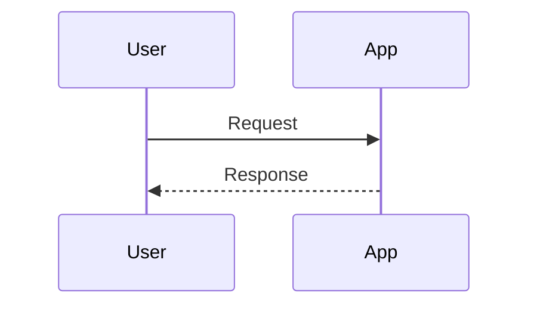

# Advanced Markdown Patterns

Use this reference for GitHub READMEs, project documentation, rich Markdown snippets, and renderer-specific polish.

## GitHub Flavored Markdown

- Use tables for compact structured data.
- Use task lists for checklist state in issues, PRs, and lightweight project plans.
- Use footnotes for supporting detail that would interrupt the main flow.
- Use strikethrough for visible deprecation or correction, not routine deletion.
- Use GitHub alerts sparingly:

```markdown
> [!NOTE]
> Helpful context.

> [!WARNING]
> A risk the reader should notice before acting.
```

## Collapsible Sections

Use `<details>` for long optional material, logs, examples, or troubleshooting notes.

```markdown
<details>
<summary>Show details</summary>

Markdown content goes here.

</details>
```

Keep blank lines after `<summary>` and before `</details>` so Markdown inside the block renders correctly.

## Images And Media

- Standard image syntax supports alt text and optional titles: ``.
- For GitHub theme-specific images, append `#gh-dark-mode-only` and `#gh-light-mode-only` to separate image paths.
- For alignment or sizing in READMEs, use raw HTML only when acceptable:

```html
<p align="center">
  
</p>
```

- For videos on GitHub, upload or reference a supported video URL directly when the platform renders it as media.
- Do not use image-only text when accessible prose or alt text is needed.

## Diagrams

Use Mermaid code fences when the renderer supports Mermaid and the diagram benefits from being text-editable.

````markdown

````

Prefer diagrams for architecture, sequences, states, dependencies, and decision flows. Keep labels short enough to render cleanly.

## Badges

Use badges at the top of READMEs when they provide current status readers care about, such as CI, package version, license, coverage, or security scans.

```markdown
[](https://github.com/org/repo/actions/workflows/ci.yml)
```

Avoid badge clutter; a row of stale badges weakens trust.

## Front Matter

Use YAML front matter for static-site metadata only when the target tooling expects it.

```yaml
---
title: Docs Title
description: Short search-friendly summary
---
```

Preserve existing front matter during edits and verify that quoting, dates, arrays, and multiline strings remain valid YAML.

## File Trees

Use plain fenced code blocks for maximum portability. In GitHub READMEs, `text` or `graphql` fences are often used for readable tree highlighting.

```text
src/
  components/
  pages/
  utils/
```

## Raw HTML Guidance

Raw HTML can help with alignment, sizing, centered content, tables-as-layout, tiny text, or embedded SVG/CSS tricks, but it is renderer-specific and can be sanitized. Prefer simple, accessible Markdown unless the user explicitly wants README polish for a renderer that supports the HTML.
